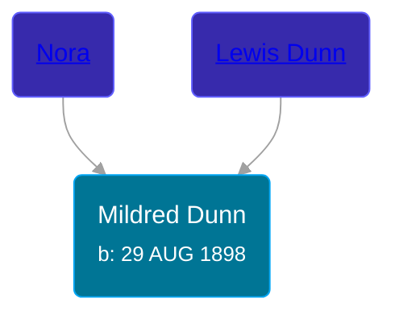

## 🟣 Mildred Dunn

Daughter of [Lewis Dunn](/people/1/14066328) and [Nora ](/people/3/37580902)



```mermaid
graph
classDef grands fill:#193cb8,stroke:#2b7fff,stroke-width:1px,color:#fff;
classDef parents fill:#372aac,stroke:#615fff,stroke-width:1px,color:#fff;
classDef primary fill:#007595,stroke:#00a6f4,stroke-width:1px,color:#fff;
7869963(Mildred Dunn<br /><small>b: 29 AUG 1898</small>):::primary
37580902(<a class="text-white" href="/people/3/37580902">Nora </a>):::parents-->7869963
14066328(<a class="text-white" href="/people/1/14066328">Lewis Dunn</a>):::parents-->7869963
linkStyle default stroke:#a1a1a1
```


### 📆 Events


Type | Date | Age at Event | Place
------ | ------ | ------ | ------
[Birth](#event-event-0) | 29 AUG 1898 |  | Perry, Michigan, USA
[Residence](#event-event-1) | 12 APR 1930 | 31y, 7m, 13d | Rives, Jackson, Michigan, USA
[Residence](#event-event-2) | 20 APR 1950 | 51y, 7m, 21d | Rives, Jackson, Michigan, USA



- **[Birth](#event-event-0)**
**Date**: 29 AUG 1898, Age:
**Place**: Perry, Michigan, USA
- **[Residence](#event-event-1)**
**Date**: 12 APR 1930, Age: 31y, 7m, 13d
**Place**: Rives, Jackson, Michigan, USA
- **[Residence](#event-event-2)**
**Date**: 20 APR 1950, Age: 51y, 7m, 21d
**Place**: Rives, Jackson, Michigan, USA


## 👩‍❤️‍👨 Relationships

### 🔵 [Edward Densmore](/people/7/75117844), b. 15 MAR 1891

#### Events


Type | Date | Age at Event | Place
------ | ------ | ------ | ------
Marriage | 05 JAN 1918 | 19y, 4m, 6d | Jackson, Michigan, USA
[Divorce](#event-family-0-event-1) | 17 JUN 1937 | 38y, 9m, 18d | Jackson, Jackson, Michigan, USA



- **Marriage**
**Date**: 05 JAN 1918, Age: 19y, 4m, 6d
**Place**: Jackson, Michigan, USA
- **[Divorce](#event-family-0-event-1)**
**Date**: 17 JUN 1937, Age: 38y, 9m, 18d
**Place**: Jackson, Jackson, Michigan, USA


#### Children With Edward Densmore
* 🟣 [Living Person](/people/3/37254066)
* 🟣 [Living Person](/people/2/22927641)
* 🔵 [Living Person](/people/7/79059120)
* 🟣 [Helen Mildred Densmore](/people/5/54702290), b. 15 APR 1925
* 🔵 [Living Person](/people/1/12457038)
* 🔵 [Richard Earl Densmore](/people/9/97910564), b. 17 JUL 1932
* 🔵 [Russell Merle Densmore](/people/4/47260456), b. 17 JUL 1932
* 🟣 [Living Person](/people/7/74409131)
### 📰 Event Sources

####  Birth, 29 AUG 1898
* Michigan, U.S., Birth Records, 1867-1914
>
  > Name: Mildred B. Dunn
  > Gender: Female
  > Race: White
  > Birth Date: 29 Aug 1898
  > Birth Place: Perry, Michigan, USA
  > Father: Lewis Dunn
  > Mother: Nora Dunn
  > Jurisdiction Number: 6173
  > Reference Number: 144
  >

####  Residence, 12 APR 1930
* 1930 US Census

####  Divorce, 17 JUN 1937
* Michigan, Divorce Records, 1897-1952
>
  > Name: Mildred B Densmore
  > Marriage Date: 5 Jan 1918
  > Marriage Place: Jackson, Michigan
  > Decree Date: 17 Jun 1937
  > Decree Place: Jackson, Michigan, USA
  > Spouse: Edward Densmore
  > State File Number: 38 3371
  > Docket Number: 15-177
  > Divorce Status: Granted
  > Was Case Contested: No
  > Number of Minor Children in Family: 6
  > Cause: Ex Cruelty

####  Residence, 20 APR 1950
* 1950 US Census
>
  > Name: Mildred B Densmore
  > Age: 51
  > Birth Date: abt 1899
  > Gender: Female
  > Race: White
  > Birth Place: Michigan
  > Marital Status: Divorced
  > Relation to Head of House: Head
  > Residence Date: 1950
  > Home in 1950: Rives, Jackson, Michigan, USA
  > Street Name: Maple Lane Road
  > Farm: Yes
  > Acres: Yes
  > Questionnaire Number: 1212
  > Occupation: Pinch Press Operator
  > Industry: Toy Mfgs
  > Occupation Category: Working
  > Hours Worked: 40
  > Worker Class: Private
  >
  > Household Members
  > Mildred B Densmore, 51, Head
  > Dale L Densmore, 20, Son
  > Russell M Densmore, 18, Son
  > Donna J Densmore, 14, Daughter
