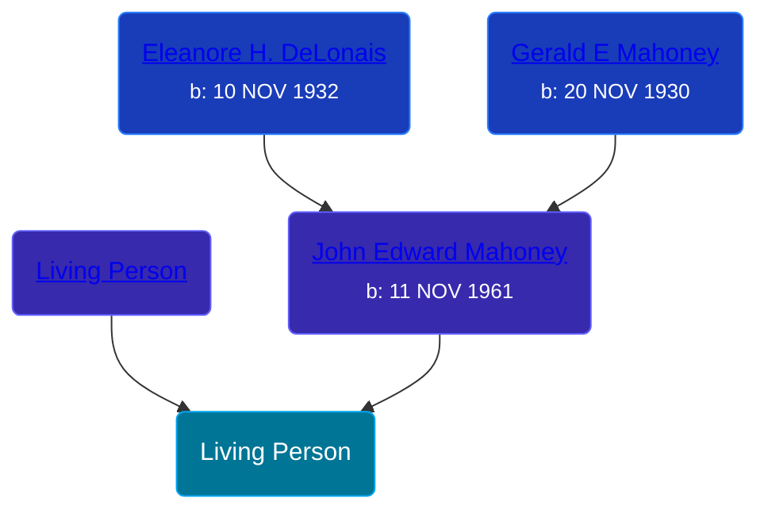

## 🔵 Living Person

Son of [John Edward Mahoney](/people/2/20318131) and [Living Person](/people/2/27906701)





## 👩‍❤️‍👨 Relationships

### 🟣 [Living Person](/people/9/91797184)

#### Children With Living Person
* 🟣 [Living Person](/people/4/42163172)
* 🔵 [Living Person](/people/7/73409028)
* 🟣 [Living Person](/people/2/29332362)