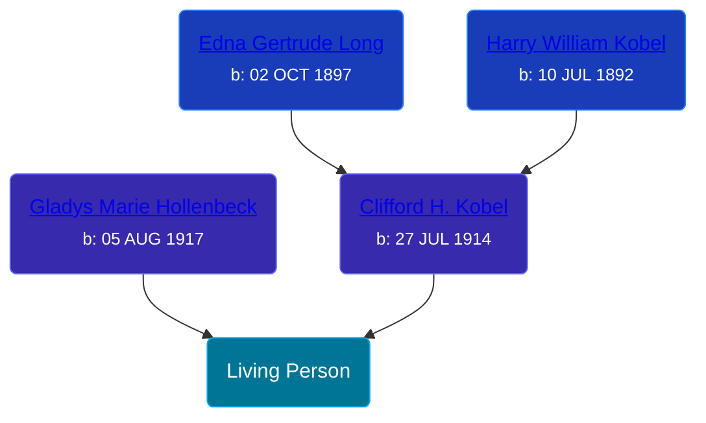

## üîµ Living Person

Son of [Clifford H. Kobel](/people/2/28732388) and [Gladys Marie Hollenbeck](/people/5/52265274)



```mermaid
graph
classDef grands fill:#193cb8,stroke:#2b7fff,stroke-width:1px,color:#fff;
classDef parents fill:#372aac,stroke:#615fff,stroke-width:1px,color:#fff;
classDef primary fill:#007595,stroke:#00a6f4,stroke-width:1px,color:#fff;
79176855(Living Person):::primary
52265274(<a class="text-white" href="/people/5/52265274">Gladys Marie Hollenbeck</a><br /><small>b: 05 AUG 1917</small>):::parents-->79176855
28732388(<a class="text-white" href="/people/2/28732388">Clifford H. Kobel</a><br /><small>b: 27 JUL 1914</small>):::parents-->79176855
33710863(<a class="text-white" href="/people/3/33710863">Edna Gertrude Long</a><br /><small>b: 02 OCT 1897</small>):::grands-->28732388
30496161(<a class="text-white" href="/people/3/30496161">Harry William Kobel</a><br /><small>b: 10 JUL 1892</small>):::grands-->28732388
```


## 👩‍❤️‍👨 Relationships

### 🟣 [Living Person](/people/1/18150729)
