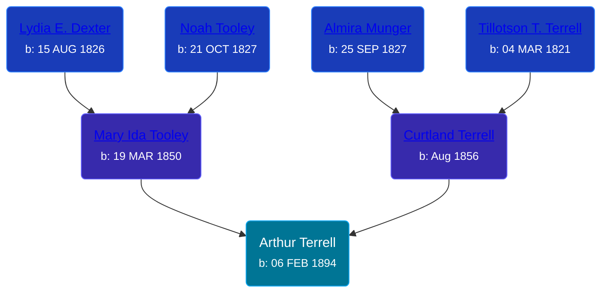

## 🔵 Arthur Terrell
<small>Age: 69y, 8m, 23d</small>

Son of [Curtland Terrell](/people/4/47972604) and [Mary Ida Tooley](/people/5/52009861)





### 📆 Events


Type | Date | Age at Event | Place
------ | ------ | ------ | ------
[Birth](#event-event-2) | 06 FEB 1894 |  | Paris Township, Kent, Michigan, USA
[Residence](#event-event-0) | 1894 | -1y, 9m, 24d | Paris Township, Kent, Michigan, USA
[Residence](#event-event-1) | 1900 | 5y, 9m, 24d | Paris Township, Kent, Michigan, USA
[Residence](#event-event-2) | 1910 | 15y, 9m, 24d | Paris Township, Kent, Michigan, USA
[Death](#event-event-6) | 29 OCT 1963 | 69y, 8m, 23d | Grand Rapids, Kent, Michigan, United States
[Burial](#event-event-7) |  |  | Greenwood Cemetery, Sparta, Kent, Michigan, USA



- **[Birth](#event-event-2)**
**Date**: 06 FEB 1894, Age:
**Place**: Paris Township, Kent, Michigan, USA
- **[Residence](#event-event-0)**
**Date**: 1894, Age: -1y, 9m, 24d
**Place**: Paris Township, Kent, Michigan, USA
- **[Residence](#event-event-1)**
**Date**: 1900, Age: 5y, 9m, 24d
**Place**: Paris Township, Kent, Michigan, USA
- **[Residence](#event-event-2)**
**Date**: 1910, Age: 15y, 9m, 24d
**Place**: Paris Township, Kent, Michigan, USA
- **[Death](#event-event-6)**
**Date**: 29 OCT 1963, Age: 69y, 8m, 23d
**Place**: Grand Rapids, Kent, Michigan, United States
- **[Burial](#event-event-7)**
**Date**:
**Place**: Greenwood Cemetery, Sparta, Kent, Michigan, USA


### 📰 Event Sources

####  Residence, 1894
* 1894 Michigan State Census

####  Birth, 06 FEB 1894
* U.S., World War II Draft Registration Cards, 1942
>   
  > Name: Arthur Terrell  
  > Age: 48  
  > Birth Date: 6 Feb 1894  
  > Residence Year: 1942  
  > Residence: Lowell, Michigan, USA

####  Residence, 1900
* 1900 US Census

####  Residence, 1910
* 1910 US Census

####  Death, 29 OCT 1963
* The Grand Rapids Press  - 30 Oct 1963
>   
  > TERRELL -- Arthur Terrell, aged 69, of 124 Broman Rd. Sparta, passed away Tuesday at St. Mary's Hospital. He is survived by his wife Christina; four sons, Arthur Jr. of Grand Rapids, Paul of Saranac, Richard of Sparta, Fred of South Carolina; three daughters, Mrs. Sylvester (Clara) Selbold of Sparta, Mrs. Minnie Terrell of Grand Rapids, Mrs. Russell (Virginia) Uplinger of Sparta; 19 grandchildren; three great-grandchildren. Funeral services will be held Saturday 1 p.m. at the Hessel Funeral Home with Rev. Paul Price officiating. Interment Greenwood Cemetery.
* U.S., Social Security Death Index, 1935-2014
>   
  > Name: Arthur Terrell Sr  
  > Birth: 06 Feb 1894  
  > Death: Oct 1963  
  > Last Residence: Michigan  
  > Last Benefit: (non specified)  
  > SSN: ###-##-####  
  > Issued: Michigan

####  Burial
* Greenwood Cemetery
>   
  > Last Name: TERRELL  
  > First Name: ARTHUR  
  > Birth: 1896  
  > Death: 29 OCT 1963