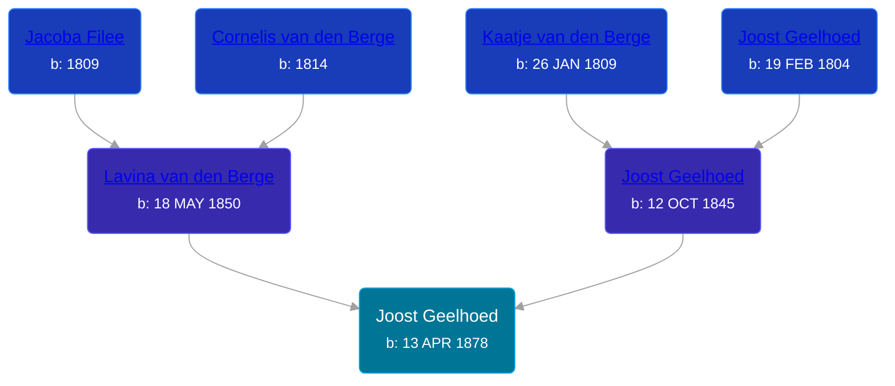

## 🔵 Joost Geelhoed
<small>Age: 80y, 8m, 20d</small>

Son of [Joost Geelhoed](/people/7/73673934) and [Lavina van den Berge](/people/7/71558365)





### 📆 Events


Type | Date | Age at Event | Place
------ | ------ | ------ | ------
[Birth](#event-event-2) | 13 APR 1878 |  | Dreischor, Zeeland, Netherlands
[Immigration](#event-event-0) | 17 MAY 1881 | 3y, 1m, 4d |
[Death](#event-event-4) | 03 JAN 1959 | 80y, 8m, 20d | Grand Rapids, Kent, Michigan, United States
Burial |  |  | Oak Hill Cemetery, Grand Rapids, Kent, Michigan, United States



- **[Birth](#event-event-2)**
**Date**: 13 APR 1878, Age:
**Place**: Dreischor, Zeeland, Netherlands
- **[Immigration](#event-event-0)**
**Date**: 17 MAY 1881, Age: 3y, 1m, 4d
**Place**:
- **[Death](#event-event-4)**
**Date**: 03 JAN 1959, Age: 80y, 8m, 20d
**Place**: Grand Rapids, Kent, Michigan, United States
- **Burial**
**Date**:
**Place**: Oak Hill Cemetery, Grand Rapids, Kent, Michigan, United States


### 📰 Event Sources

####  Birth, 13 APR 1878
* Geelhoet, Geelhoed & Geelhoedt Genealogie  - 142
* U.S., World War I Draft Registration Cards, 1917-1918  - Roll: 1675765

####  Immigration, 17 MAY 1881
* New York, Passenger Lists, 1820-1957

####  Death, 03 JAN 1959
* The Grand Rapids Press  - 6 Jan 1959
>   
  > GEELHOED -- Joseph Geelhoed, aged 80, of 1621 Martindale av., SW, passed away Saturday evening, Jan 3, at Butterworth hospital. Surviving are his wife Jessie; three sons, Richard, Edward and Neal Geelhoed; one daughter, Mrs. Thomas (Lavina) Kelder; eight grandchildren; six great grandchildren and one sister, Mrs. George Westra. Funeral services were held Tuesday, Jan. 6, at the Kuiper Funeral Home, Rev. F. Dolfin officiating. Interment Oak Hill cemetery.
* Geelhoet, Geelhoed & Geelhoedt Genealogie  - 142
