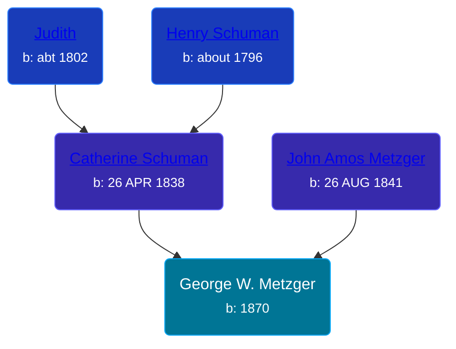

## 🔵 George W. Metzger
<small>Age: 4m, 17d</small>

Son of [John Amos Metzger](/people/2/28893894) and [Catherine Schuman](/people/3/39599940)





### 📆 Events


Type | Date | Age at Event | Place
------ | ------ | ------ | ------
Birth | 1870 |  | Indiana, USA
Death | 17 APR 1870 | 4m, 17d | Indiana, USA
[Burial](#event-event-4) |  |  | Troy Presbyterian Cemetery, Troy Township, Whitley, Indiana, USA



- **Birth**
**Date**: 1870, Age:
**Place**: Indiana, USA
- **Death**
**Date**: 17 APR 1870, Age: 4m, 17d
**Place**: Indiana, USA
- **[Burial](#event-event-4)**
**Date**:
**Place**: Troy Presbyterian Cemetery, Troy Township, Whitley, Indiana, USA


### 📰 Event Sources

####  Burial
* Troy Presbyterian Cemetery, Indiana
>   
  > Metzger George W - died April 17 1870 1 month 10 days - Son of J.A. &C - Troy Presbyterian-12-28
