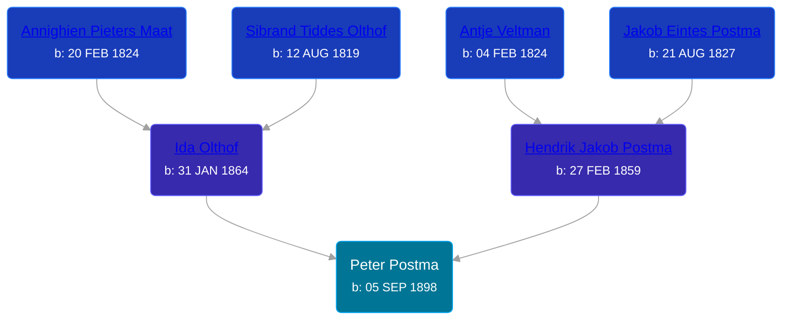

## 🔵 Peter Postma
<small>Age: 85y, 7m, 1d</small>

Son of [Hendrik Jakob Postma](/people/3/31727152) and [Ida Olthof](/people/6/60020862)





### 📆 Events


Type | Date | Age at Event | Place
------ | ------ | ------ | ------
[Birth](#event-event-2) | 05 SEP 1898 |  | Gaines Township, Kent, Michigan, USA
[Residence](#event-event-0) | 29 JUN 1900 | 1y, 9m, 24d | Gaines Township, Kent, Michigan, USA
[Residence](#event-event-1) | 1910 | 11y, 2m, 25d | Gaines Township, Kent, Michigan, USA
[Residence](#event-event-2) | 1920 | 21y, 2m, 25d | Gaines Township, Kent, Michigan, USA
[Residence](#event-event-3) | 28 APR 1930 | 31y, 7m, 23d | Grand Rapids, Kent, Michigan, United States
[Residence](#event-event-4) | 1935 | 36y, 2m, 25d | Wyoming, Kent, Michigan, USA
[Residence](#event-event-5) | 26 APR 1940 | 41y, 7m, 21d | Wyoming, Kent, Michigan, USA
[Death](#event-event-9) | 06 APR 1984 | 85y, 7m, 1d | Grand Rapids, Kent, Michigan, United States
Burial | 09 APR 1984 | 85y, 7m, 4d | Pine Hill Cemetery, Kentwood, Kent, Michigan, USA



- **[Birth](#event-event-2)**
**Date**: 05 SEP 1898, Age:
**Place**: Gaines Township, Kent, Michigan, USA
- **[Residence](#event-event-0)**
**Date**: 29 JUN 1900, Age: 1y, 9m, 24d
**Place**: Gaines Township, Kent, Michigan, USA
- **[Residence](#event-event-1)**
**Date**: 1910, Age: 11y, 2m, 25d
**Place**: Gaines Township, Kent, Michigan, USA
- **[Residence](#event-event-2)**
**Date**: 1920, Age: 21y, 2m, 25d
**Place**: Gaines Township, Kent, Michigan, USA
- **[Residence](#event-event-3)**
**Date**: 28 APR 1930, Age: 31y, 7m, 23d
**Place**: Grand Rapids, Kent, Michigan, United States
- **[Residence](#event-event-4)**
**Date**: 1935, Age: 36y, 2m, 25d
**Place**: Wyoming, Kent, Michigan, USA
- **[Residence](#event-event-5)**
**Date**: 26 APR 1940, Age: 41y, 7m, 21d
**Place**: Wyoming, Kent, Michigan, USA
- **[Death](#event-event-9)**
**Date**: 06 APR 1984, Age: 85y, 7m, 1d
**Place**: Grand Rapids, Kent, Michigan, United States
- **Burial**
**Date**: 09 APR 1984, Age: 85y, 7m, 4d
**Place**: Pine Hill Cemetery, Kentwood, Kent, Michigan, USA


### 📰 Event Sources

####  Birth, 05 SEP 1898
* Michigan, U.S., Birth Records, 1867-1914
>   
  > Name: Peter Postma  
  > Gender: Male  
  > Race: White  
  > Birth Date: 5 Sep 1898  
  > Birth Place: Gaines, Michigan, USA  
  > Father: Henry Postma  
  > Mother: Ida Postma  
  > Jurisdiction Number: 14166  
  > Reference Number: 82  
  >

####  Residence, 29 JUN 1900
* 1900 US Census
>   
  > Name: Peter Postma  
  > Sex: Male  
  > Age: 2  
  > Birth Date: October 1898  
  > Birthplace: Michigan  
  > Marital Status: Single  
  > Race: White  
  > Relationship to Head of Household: Son  
  > Father's Birthplace: Holland  
  > Mother's Birthplace: Holland  
  > Event Type: Census  
  > Event Date: 1900  
  > Event Place: Gaines Township, Kent, Michigan, United States  
  > Line Number: 15  
  > Sheet Letter: A  
  > Sheet Number: 13  
  >

####  Residence, 1910
* 1910 US Census

####  Residence, 1920
* 1920 US Census

####  Residence, 28 APR 1930
* 1930 US Census

####  Residence, 1935
* 1940 US Census

####  Residence, 26 APR 1940
* 1940 US Census

####  Death, 06 APR 1984
* The Grand Rapids Press  - 7 Apr 1984
>   
  > POSTMA -- Peter Postma, aged 85, of Wyoming, passed away Friday, April6, 1984. Surviving are his wife, Elizabeth; his son and wife, Donald and Marcella Postma of Jenison; four grandchildren, five great-grandchildren; a brother, Charles Postma of Lowell; a brother-in-law, WilliamSlager of Wyoming; a sister-in-law, Mrs. Ida Postma of Cutlerville; several nieces and nephews. Funeral Services will be held Monday at 1:00 in the Ronan-Vanderpool-Stegenga Funeral Chapel, 3131 S. Division, Rev. James Fox officiating. Interment Pine Hill Cemetery.
* Michigan Deaths, 1971-1996
>   
  > Name:  Peter Postma  
  > Birth Date: 5 Sep 1998  
  > Death Date: 6 Apr 1984  
  > Gender: Male  
  > Residence: Wyoming, Kent, Michigan  
  > Place of Death: Grand Rapids, Kent, Michigan
* U.S., Social Security Death Index, 1935-2014
>   
  > Name: PETER POSTMA  
  > Birth: 05 Sep 1898  
  > Death: Apr 1984  
  > Last Residence: 49509 (Grand Rapids, Kent, MI)  
  > Last Benefit: 49428 (Jenison, Ottawa, MI)  
  > SSN: ###-##-####  
  > Issued: Michigan
