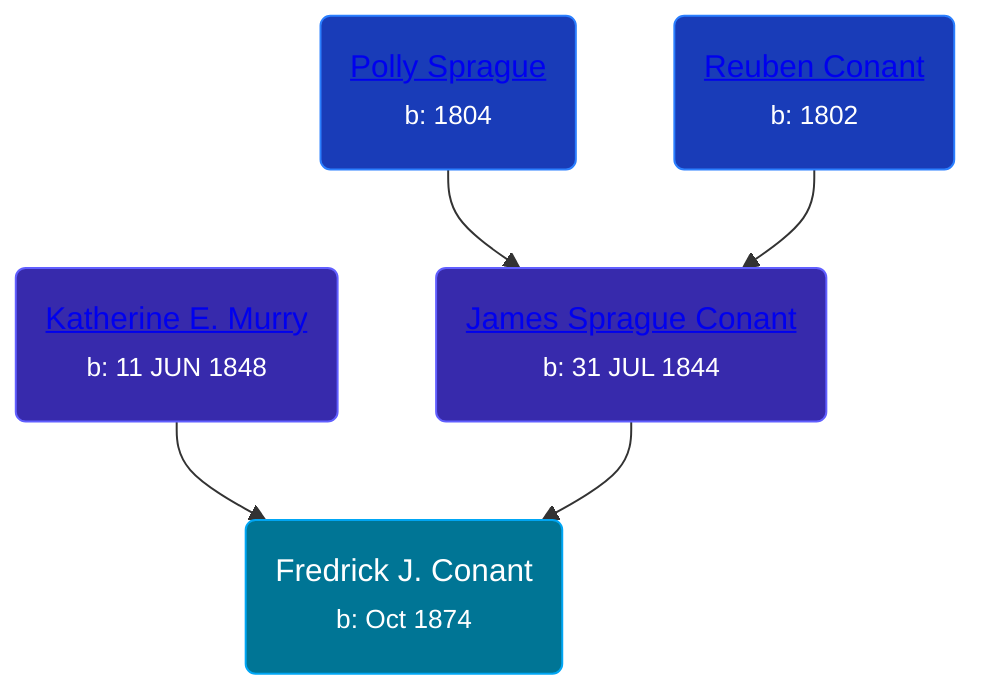

## 🔵 Fredrick J. Conant

Son of [James Sprague Conant](/people/6/62404416) and [Katherine E. Murry](/people/2/25746290)





### 📆 Events


Type | Date | Age at Event | Place
------ | ------ | ------ | ------
Birth | Oct 1874 |  | Michigan, USA
[Residence](#event-event-0) | 1880 | 5y, 2m | Robinson Township, Ottawa, Michigan, USA
[Residence](#event-event-1) | 1900 | 25y, 2m | Robinson Township, Ottawa, Michigan, USA
[Residence](#event-event-2) | 1910 | 35y, 2m | Robinson Township, Ottawa, Michigan, USA



- **Birth**
**Date**: Oct 1874, Age:
**Place**: Michigan, USA
- **[Residence](#event-event-0)**
**Date**: 1880, Age: 5y, 2m
**Place**: Robinson Township, Ottawa, Michigan, USA
- **[Residence](#event-event-1)**
**Date**: 1900, Age: 25y, 2m
**Place**: Robinson Township, Ottawa, Michigan, USA
- **[Residence](#event-event-2)**
**Date**: 1910, Age: 35y, 2m
**Place**: Robinson Township, Ottawa, Michigan, USA


## 👩‍❤️‍👨 Relationships

### 🟣 [Living Person](/people/8/84331585)

#### Children With Living Person
* 🔵 [Living Person](/people/9/99028500)
* 🟣 [Living Person](/people/8/81597840)
* 🔵 [Edmond A. Conant](/people/5/5523762), b. 21 DEC 1904
### 📰 Event Sources

####  Residence, 1880
* 1880 US Census

####  Residence, 1900
* 1910 US Census

####  Residence, 1910
* 1910 US Census
