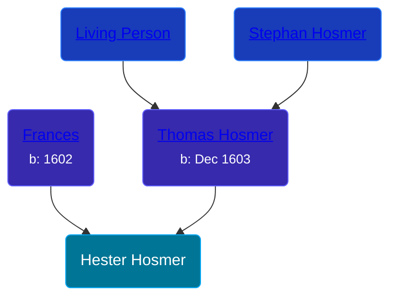

## 🟣 Hester Hosmer
<small>Age: undefined</small>

Daughter of [Thomas Hosmer](/people/7/70805658) and [Frances ](/people/1/15178620)





### 📆 Events


Type | Date | Age at Event | Place
------ | ------ | ------ | ------
[Birth](#event-event-2) |  |  |
[Death](#event-event-3) | 03 JUN 1702 | undefined |



- **[Birth](#event-event-2)**
**Date**:
**Place**:
- **[Death](#event-event-3)**
**Date**: 03 JUN 1702, Age: undefined
**Place**:


### 📰 Event Sources

####  Birth
* Genealogy of the Hosmer Family  - 4

####  Death, 03 JUN 1702
* The Buckingham Family, or, the Descendants of Thomas Buckingham  - 139