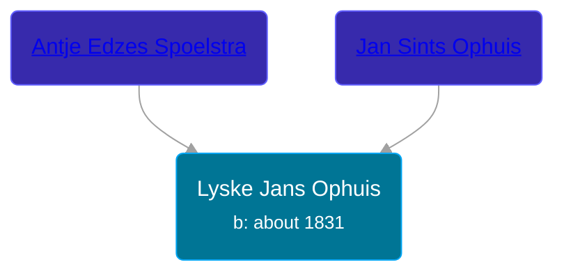

## 🟣 Lyske Jans Ophuis

Daughter of [Jan Sints Ophuis](/people/3/33968752) and [Antje Edzes Spoelstra](/people/6/68221434)





### 📆 Events


Type | Date | Age at Event | Place
------ | ------ | ------ | ------
Birth | about 1831 |  |



- **Birth**
**Date**: about 1831, Age:
**Place**:


## 👩‍❤️‍👨 Relationships

### 🔵 [Riekele Postma](/people/4/40864364), b. 17 SEP 1838

#### Events


Type | Date | Age at Event | Place
------ | ------ | ------ | ------
[Marriage](#event-family-0-event-0) | 10 FEB 1872 | 41y, 2m, 10d | Achtkarspelen, Netherlands



- **[Marriage](#event-family-0-event-0)**
**Date**: 10 FEB 1872, Age: 41y, 2m, 10d
**Place**: Achtkarspelen, Netherlands


### 📰 Event Sources

####  Marriage, 10 FEB 1872
* Dutch Civil Register
>   
  > Source Civil register - Marriage  
  > Archive location: Tresoar, Frysk Histoarysk en Letterkundich Sintrum  
  > General Number of finding aid: 30-01  
  > Item number: 2019  
  > Municipality: Achtkarspelen  
  > Type of record: Huwelijksakte  
  > Record number: 4  
  > Registration date: 10-02-1862  
  > Bridegroom: Riekele Postma  
  > Age: 23  
  > Place of birth: Surhuisterveen  
  > Bride: Lyske Jans Ophuis  
  > Age: 31  
  > Place of birth: Surhuizum  
  > Father bridegroomEinte Wolters Postma  
  > Mother bridegroomRiekeltje Jakobs Wagenaar  
  > Father bride: Jan Sints Ophuis  
  > Mother bride: Antje Edzes Spoelstra