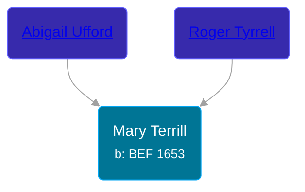

## 🟣 Mary Terrill
<small>Age: 1y, 5m, 5d</small>

Daughter of [Roger Tyrrell](/people/2/2108514) and [Abigail Ufford](/people/9/99473444)





### 📆 Events


Type | Date | Age at Event | Place
------ | ------ | ------ | ------
[Birth](#event-event-2) | BEF 1653 |  |
[Baptism](#event-event-0) | 12 FEB 1653 | 2m, 12d |
[Death](#event-event-4) | 05 MAY 1654 | 1y, 5m, 5d |



- **[Birth](#event-event-2)**
**Date**: BEF 1653, Age:
**Place**:
- **[Baptism](#event-event-0)**
**Date**: 12 FEB 1653, Age: 2m, 12d
**Place**:
- **[Death](#event-event-4)**
**Date**: 05 MAY 1654, Age: 1y, 5m, 5d
**Place**:


### 📰 Event Sources

####  Birth, BEF 1653
* Roger and Abigail (Ufford) Terrill and Some Descendants: 1632 - 1993  - 6

####  Baptism, 12 FEB 1653
* Roger and Abigail (Ufford) Terrill and Some Descendants: 1632 - 1993  - 6

####  Death, 05 MAY 1654
* Roger and Abigail (Ufford) Terrill and Some Descendants: 1632 - 1993  - 6