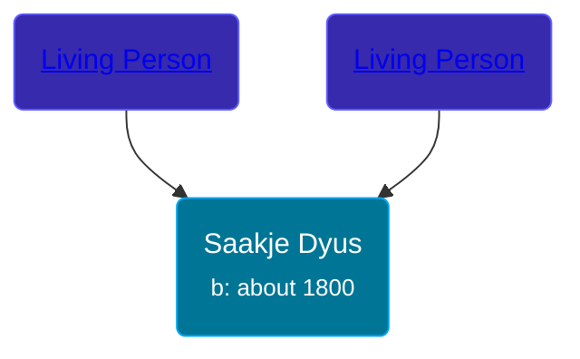

## 🟣 Saakje Dyus

Daughter of [Living Person](/people/6/65255973) and [Living Person](/people/2/26091395)





### 📆 Events


Type | Date | Age at Event | Place
------ | ------ | ------ | ------
Birth | about 1800 |  |



- **Birth**
**Date**: about 1800, Age:
**Place**:


## 👩‍❤️‍👨 Relationships

### 🔵 [Wytze Wolters Postma](/people/6/61192664), b. about 1811

#### Events


Type | Date | Age at Event | Place
------ | ------ | ------ | ------
[Marriage](#event-family-0-event-0) | 02 AUG 1832 | 32y, 8m, 2d | Opsterland, Netherlands



- **[Marriage](#event-family-0-event-0)**
**Date**: 02 AUG 1832, Age: 32y, 8m, 2d
**Place**: Opsterland, Netherlands


### 📰 Event Sources

####  Marriage, 02 AUG 1832
* Dutch Civil Register
>   
  > Groom: Wytze Wolters Postma  
  > Place of birth: Duurswoude  
  > Age: 21  
  > Father of the groom: Wolter Wolters Postma  
  > Mother of the groom: Trijntje Tjipkes  
  > Bride: Saakje Dyus  
  > Place of birth: Tjamsweer, provincie Groningen  
  > Age: 32  
  > Father of the bride: Dyu Albertus  
  > Mother of the bride: Geesjen Willems  
  > Event: Huwelijk  
  > Date: Thursday, August 02, 1832  
  > Event place: Opsterland