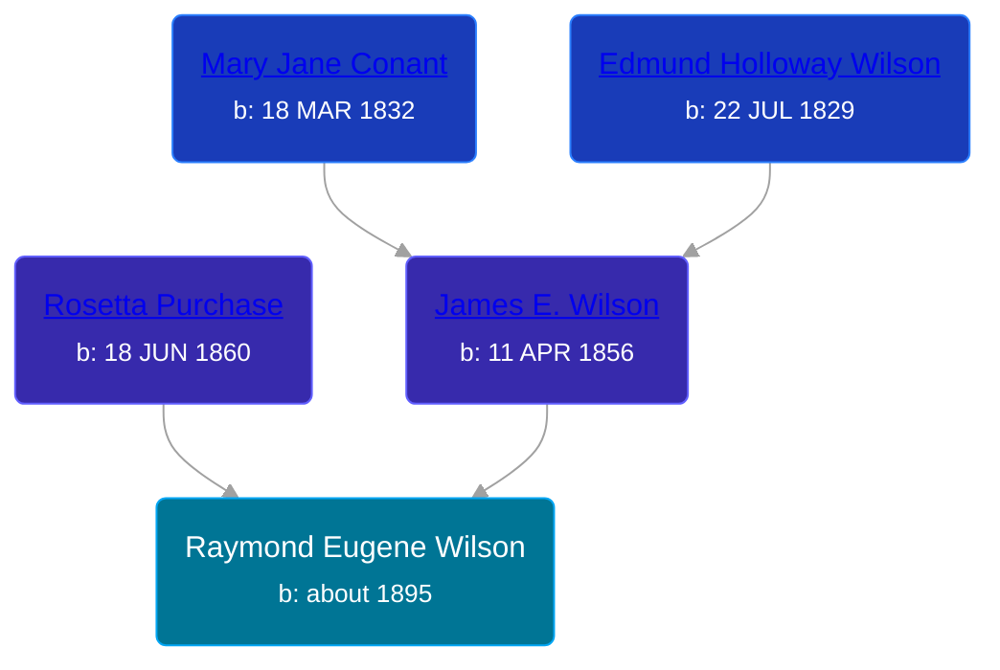

## 🔵 Raymond Eugene Wilson

Son of [James E. Wilson](/people/5/54950695) and [Rosetta Purchase](/people/2/27770192)





### 📆 Events


Type | Date | Age at Event | Place
------ | ------ | ------ | ------
Birth | about 1895 |  | Newaygo, Newaygo, Michigan, USA
[Residence](#event-event-0) | 1910 | 15y | Home Township, Montcalm, Michigan, USA



- **Birth**
**Date**: about 1895, Age:
**Place**: Newaygo, Newaygo, Michigan, USA
- **[Residence](#event-event-0)**
**Date**: 1910, Age: 15y
**Place**: Home Township, Montcalm, Michigan, USA


## 👩‍❤️‍👨 Relationships

### 🟣 [Living Person](/people/1/15065382)

### 📰 Event Sources

####  Residence, 1910
* 1910 US Census
