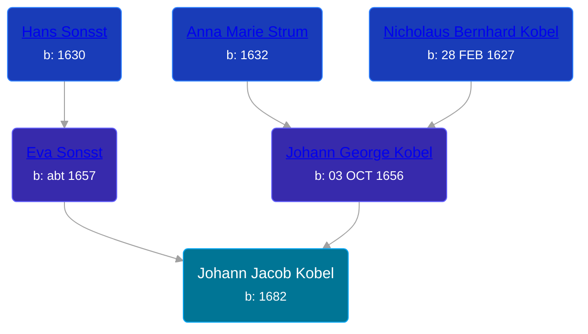

## 🔵 Johann Jacob Kobel
<small>Age: 49y, 9m</small>

Son of [Johann George Kobel](/people/9/96923637) and [Eva Sonsst](/people/4/40351050)





### 📆 Events


Type | Date | Age at Event | Place
------ | ------ | ------ | ------
Birth | 1682 |  | Hoffenheim Sinsheim, Baden, Germany
Immigration | 1709 | 27y | New York, USA
Occupation |  |  | Grist mill operator, Schoharie, New York, USA
Death | Sep 1731 | 49y, 9m | Womelsdorf, Pennsylvania, USA



- **Birth**
**Date**: 1682, Age:
**Place**: Hoffenheim Sinsheim, Baden, Germany
- **Immigration**
**Date**: 1709, Age: 27y
**Place**: New York, USA
- **Occupation**
**Date**:
**Place**: Grist mill operator, Schoharie, New York, USA
- **Death**
**Date**: Sep 1731, Age: 49y, 9m
**Place**: Womelsdorf, Pennsylvania, USA


## 👩‍❤️‍👨 Relationships

### 🟣 [Anna ](/people/4/45457809), b. 1684

#### Children With Anna
* 🔵 [Johann Heinrich Kobel](/people/7/70639420), b. 20 JUL 1712