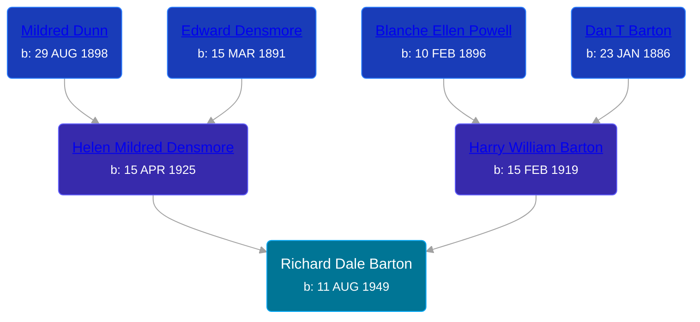

## 🔵 Richard Dale Barton
<small>Age: 28y, 3m, 17d</small>

Son of [Harry William Barton](/people/8/83492690) and [Helen Mildred Densmore](/people/5/54702290)





### 📆 Events


Type | Date | Age at Event | Place
------ | ------ | ------ | ------
Birth | 11 AUG 1949 |  |
[Residence](#event-event-0) | 13 APR 1950 | 8m, 2d | Norvell Township, Jackson, Michigan, USA
[Death](#event-event-4) | 28 NOV 1977 | 28y, 3m, 17d | Ann Arbor, Washtenaw, Michigan, USA
[Burial](#event-event-5) |  |  | Hillcrest Memorial Park, Jackson, Jackson, Michigan, USA



- **Birth**
**Date**: 11 AUG 1949, Age:
**Place**:
- **[Residence](#event-event-0)**
**Date**: 13 APR 1950, Age: 8m, 2d
**Place**: Norvell Township, Jackson, Michigan, USA
- **[Death](#event-event-4)**
**Date**: 28 NOV 1977, Age: 28y, 3m, 17d
**Place**: Ann Arbor, Washtenaw, Michigan, USA
- **[Burial](#event-event-5)**
**Date**:
**Place**: Hillcrest Memorial Park, Jackson, Jackson, Michigan, USA


### 📰 Event Sources

####  Residence, 13 APR 1950
* 1950 US Census
>   
  > Name: Richard D Barton  
  > Sex: Male  
  > Age: 8 months  
  > Birth Year (Estimated): 1949  
  > Birthplace: Michigan  
  > Residence Place: Norvell, Norvell Township, Jackson, Michigan, United States  
  > House Number: m  
  > Marital Status: Single  
  > Race: W  
  > Relationship to Head of Household: Son  
  > Father's Birthplace: Us  
  > Mother's Birthplace: Us  
  > Event Date: 12 April 1950  
  > Event Place: Norvell, Norvell Township, Jackson, Michigan, United States  
  > Event Place (Original): Norvell, Jackson, Michigan  
  > Enumeration District: 38-122  
  > Line Number: 5  
  > Page Number: 13  
  >   
  > Harry W Barton, Head, 31 years, Michigan  
  > Helen M Barton, Wife, 24 years, Michigan  
  > Harry W Barton, Jr, Son, 5 years, Michigan  
  > Robert E Barton, Son, 4 years, Michigan  
  > Richard D Barton, Son, 0 years, Michigan

####  Death, 28 NOV 1977
* Michigan Deaths, 1971-1996
>   
  > Name: Richard D Barton  
  > Birth Date: 11 Aug 1949  
  > Death Date: 28 Oct 1977  
  > Gender: Male  
  > Residence: Jackson, Jackson, Michigan  
  > Place of Death: Ann Arbor, Washtenaw, Michigan

####  Burial
* findagrave.com
