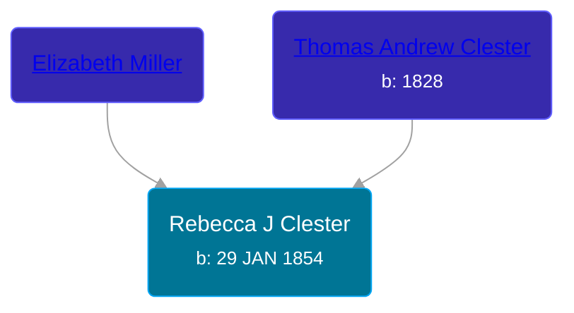

## 🟣 Rebecca J Clester
<small>Age: 39y, 4m, 13d</small>

Daughter of [Thomas Andrew Clester](/people/2/20155198) and [Elizabeth Miller](/people/2/29274128)





### 📆 Events


Type | Date | Age at Event | Place
------ | ------ | ------ | ------
Birth | 29 JAN 1854 |  | Illinois, USA
[Residence](#event-event-1) | 10 JUN 1880 | 26y, 4m, 12d | Grant, Cloud, Kansas, USA
Death | 11 JUN 1893 | 39y, 4m, 13d |
[Burial](#event-event-3) |  |  | Weber Cemetery, Webber, Jewell, Kansas, USA



- **Birth**
**Date**: 29 JAN 1854, Age:
**Place**: Illinois, USA
- **[Residence](#event-event-1)**
**Date**: 10 JUN 1880, Age: 26y, 4m, 12d
**Place**: Grant, Cloud, Kansas, USA
- **Death**
**Date**: 11 JUN 1893, Age: 39y, 4m, 13d
**Place**:
- **[Burial](#event-event-3)**
**Date**:
**Place**: Weber Cemetery, Webber, Jewell, Kansas, USA


## 👩‍❤️‍👨 Relationships

### 🔵 [John Barton](/people/5/56328061), b. abt 1844

#### Children With John Barton
* 🔵 [James P Barton](/people/6/63115555), b. abt 1872
* 🔵 [Thomas E Barton](/people/1/19666544), b. abt 1879
* 🔵 [Dan T Barton](/people/9/95106328), b. 23 JAN 1886
### 📰 Event Sources

####  Residence, 10 JUN 1880
* 1880 US Census
>
  > Name: Rebeca J. Bartin
  > Age: 29
  > Birth Date: Abt 1851
  > Birthplace: Illinois
  > Home in 1880: Grant, Cloud, Kansas, USA
  > Dwelling Number: 100
  > Race: White
  > Gender: Female
  > Relation to Head of House: Wife
  > Marital Status: Married
  > Spouse's Name: John W. Bartin
  > Father's Birthplace: Germany
  > Mother's Birthplace: Germany
  > Occupation: Housekeeper
  > Cannot Write: Y
  >
  > John W. Bartin, 36, Self (Head)
  > Rebeca J. Bartin, 29, Wife
  > James P. Bartin, 8, Son
  > Thomas E. Bartin, 1, Son
  >

####  Burial
* findagrave.com
>
  > Rebecca J.
  > wife of J.W. Barton
  > Born Jan 29, 1854
  > Died June 11, 1893
