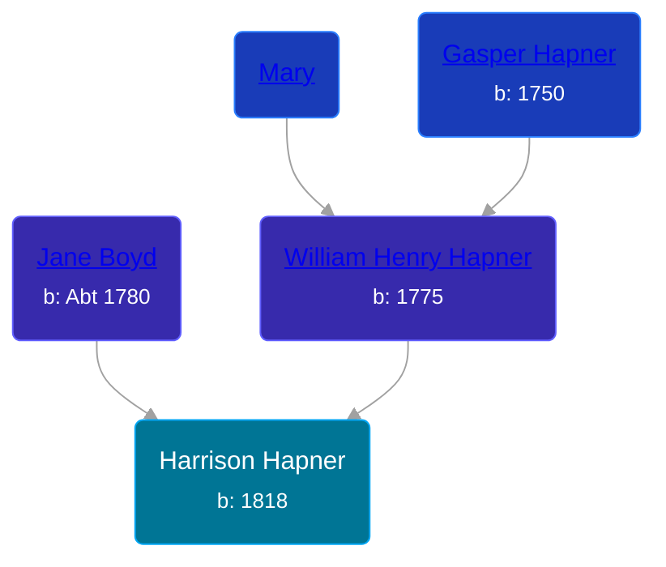

## 🔵 Harrison Hapner
<small>Age: 62y, 3m, 11d</small>

Son of [William Henry Hapner](/people/9/95017783) and [Jane Boyd](/people/5/54740480)





### 📆 Events


Type | Date | Age at Event | Place
------ | ------ | ------ | ------
Birth | 1818 |  | Ohio, USA
[Death](#event-event-3) | 11 MAR 1880 | 62y, 3m, 11d | Union Township, Isabella, Michigan, USA



- **Birth**
**Date**: 1818, Age:
**Place**: Ohio, USA
- **[Death](#event-event-3)**
**Date**: 11 MAR 1880, Age: 62y, 3m, 11d
**Place**: Union Township, Isabella, Michigan, USA


### 📰 Event Sources

####  Death, 11 MAR 1880
* Michigan, Death Records, 1867-1950
>   
  > Name: Harrison Hapner  
  > Gender: Male  
  > Race: White  
  > Marital Status: Married  
  > Death Age: 62  
  > Birth Date: 1818  
  > Birth Place: Ohio  
  > Death Date: 11 Mar 1880  
  > Death Place: Union, Isabella, Michigan, USA  
  > File Number: 749  
  > Father: Wm Hapner  
  > Mother: Jane Hapner
