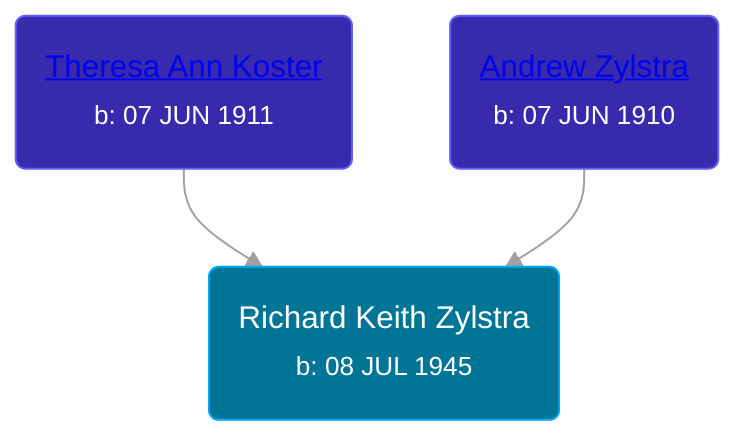

## 🔵 Richard Keith Zylstra
<small>Age: 73y, 1m, 11d</small>

Son of [Andrew Zylstra](/people/4/44051626) and [Theresa Ann Koster](/people/8/89133966)





### 📆 Events


Type | Date | Age at Event | Place
------ | ------ | ------ | ------
Birth | 08 JUL 1945 |  |
[Death](#event-event-1) | 19 AUG 2018 | 73y, 1m, 11d |
Burial | 24 AUG 2018 | 73y, 1m, 16d | Woodlawn Cemetery, Grand Rapids, Kent, Michigan, United States



- **Birth**
**Date**: 08 JUL 1945, Age:
**Place**:
- **[Death](#event-event-1)**
**Date**: 19 AUG 2018, Age: 73y, 1m, 11d
**Place**:
- **Burial**
**Date**: 24 AUG 2018, Age: 73y, 1m, 16d
**Place**: Woodlawn Cemetery, Grand Rapids, Kent, Michigan, United States


## 👩‍❤️‍👨 Relationships

### 🟣 [Patricia Gabbert](/people/3/31898817), b. abt 1945

#### Events


Type | Date | Age at Event | Place
------ | ------ | ------ | ------
Marriage | 23 NOV 1939 | -6y, 4m, 15d |



- **Marriage**
**Date**: 23 NOV 1939, Age: -6y, 4m, 15d
**Place**:


#### Children With Patricia Gabbert
* 🔵 [Living Person](/people/6/65026517)
* 🔵 [Living Person](/people/8/89027494)
### 📰 Event Sources

####  Death, 19 AUG 2018
* Dignity Memorial
>
  > Richard Keith Zylstra
  > July 8, 1945 – August 19, 2018
  >
  > Richard Keith Zylstra, age 73, went to be with his Lord on Sunday, August 19, 2018.
  >
  > He was preceded in death by his wife, Patty Zylstra; son, Michael Gilbert; great-grandson, Ethan Chad Anthony DeSero; and parents Andrew and Theresa Zylstra.
  >
  > He will be remembered by his children Manely Gilbert, Kevin Gilbert, Chad (Kim) Zylstra, Denise (Dan) Reynolds, and Mathew (Jennifer) Zylstra; 12 grandchildren; seven great-grandchildren; and many nieces, nephews and friends.
  >
  > Funeral services will be held at 11 a.m. on Friday, August 24, 2018, with visitation one hour prior, at Cook Memorial Chapel (East building), 4235 Prairie, S.W., Grandville, MI 49418. Pastor Dennis Gilbert will be officiating. Interment is at Woodlawn Cemetery.
  >
  > In honor of Richard and in lieu of flowers, contributions may be made to St. Jude Children’s Research Hospital.
  >
  > The family welcomes memories and messages in their guest book online at www.cookcares.com.
