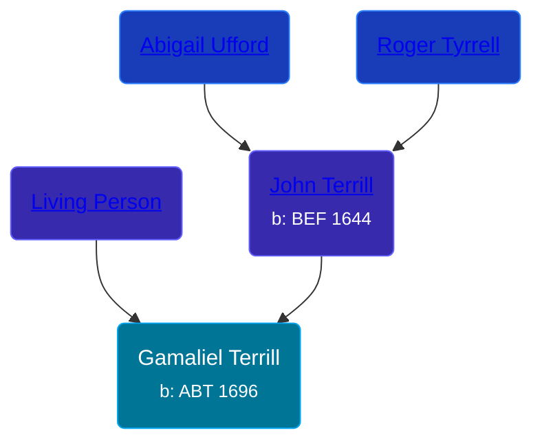

## 🔵 Gamaliel Terrill
<small>Age: 73y</small>

Son of [John Terrill](/people/6/65221157) and [Living Person](/people/4/48582652)





### 📆 Events


Type | Date | Age at Event | Place
------ | ------ | ------ | ------
[Birth](#event-event-2) | ABT 1696 |  | Milford, Connecticut, USA
[Baptism](#event-event-0) | 14 AUG 1696 | 8m, 14d |
[Death](#event-event-4) | 1769 | 73y |



- **[Birth](#event-event-2)**
**Date**: ABT 1696, Age:
**Place**: Milford, Connecticut, USA
- **[Baptism](#event-event-0)**
**Date**: 14 AUG 1696, Age: 8m, 14d
**Place**:
- **[Death](#event-event-4)**
**Date**: 1769, Age: 73y
**Place**:


### 📰 Event Sources

####  Birth, ABT 1696
* Roger and Abigail (Ufford) Terrill and Some Descendants: 1632 - 1993  - 10

####  Baptism, 14 AUG 1696
* Roger and Abigail (Ufford) Terrill and Some Descendants: 1632 - 1993  - 10

####  Death, 1769
* Roger and Abigail (Ufford) Terrill and Some Descendants: 1632 - 1993  - 22