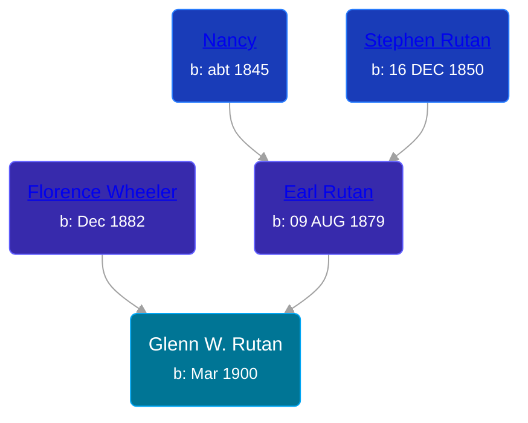

## 🔵 Glenn W. Rutan

Son of [Earl Rutan](/people/2/29949376) and [Florence Wheeler](/people/4/48964520)





### 📆 Events


Type | Date | Age at Event | Place
------ | ------ | ------ | ------
Birth | Mar 1900 |  | Michigan, USA
[Residence](#event-event-0) | 09 JUN 1900 | 3m, 9d | Somerset Township, Hillsdale, Michigan, USA



- **Birth**
**Date**: Mar 1900, Age:
**Place**: Michigan, USA
- **[Residence](#event-event-0)**
**Date**: 09 JUN 1900, Age: 3m, 9d
**Place**: Somerset Township, Hillsdale, Michigan, USA


### 📰 Event Sources

####  Residence, 09 JUN 1900
* 1900 US Census

