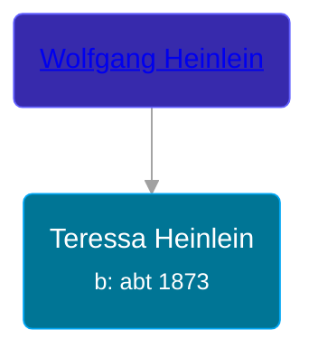

## 🟣 Teressa Heinlein

Daughter of [Wolfgang Heinlein](/people/1/10705600)





### 📆 Events


Type | Date | Age at Event | Place
------ | ------ | ------ | ------
Birth | abt 1873 |  |



- **Birth**
**Date**: abt 1873, Age:
**Place**:


## 👩‍❤️‍👨 Relationships

### 🔵 [James H. Greene](/people/6/69280584), b. abt 1869

#### Events


Type | Date | Age at Event | Place
------ | ------ | ------ | ------
[Marriage](#event-family-0-event-0) | 07 SEP 1897 | 24y, 9m, 7d | Saginaw, Saginaw, Michigan, USA



- **[Marriage](#event-family-0-event-0)**
**Date**: 07 SEP 1897, Age: 24y, 9m, 7d
**Place**: Saginaw, Saginaw, Michigan, USA


### 📰 Event Sources

####  Marriage, 07 SEP 1897
* Michigan, U.S., County Marriage Records, 1822-1940
>   
  > Name: James H. Greene  
  > Gender: Male  
  > Age: 28  
  > Birth Date: abt 1869  
  > Marriage Date: 7 Sep 1897  
  > Marriage Place: Saginaw, Michigan, USA  
  > Father: Andrew Greene  
  > Mother: Flynn  
  > Spouse: Teressa Heinlein  
  > Spouse Gender: Female  
  > Spouse Age: 24  
  > Spouse Birth Date: abt 1873  
  > Spouse Father: Wolfgang Heinlein  
  > Film Number: 000967190