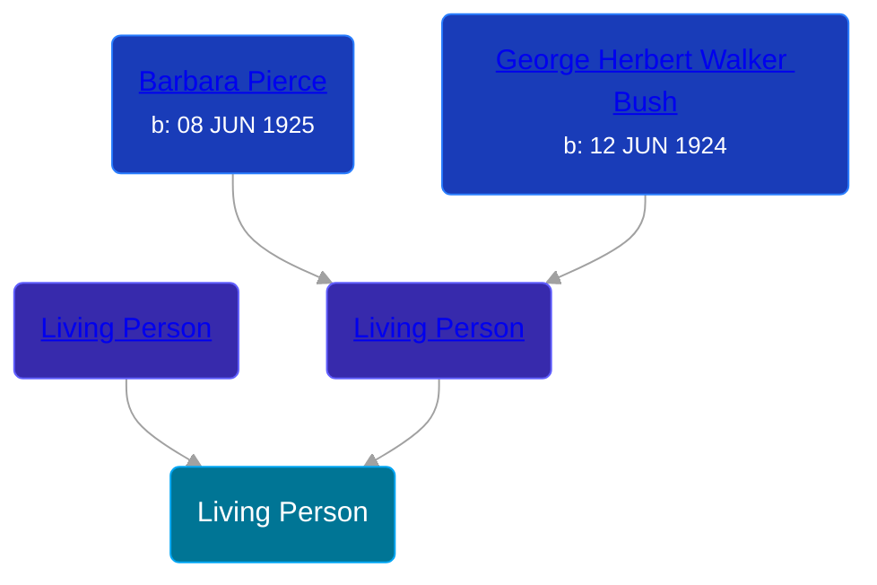

## 🟣 Jenna Welch Bush

Daughter of [George Walker Bush](/people/2/29497980) and [Living Person](/people/7/74109505)





> [!note]
> This is a public figure and therefore bypasses some privacy restrictions for living persons.

## 📝 Notes
>   
  > Jenna Bush Hager is a news personality and author, working for NBC. She is the daughter of the 43rd President of the United States, George W Bush.