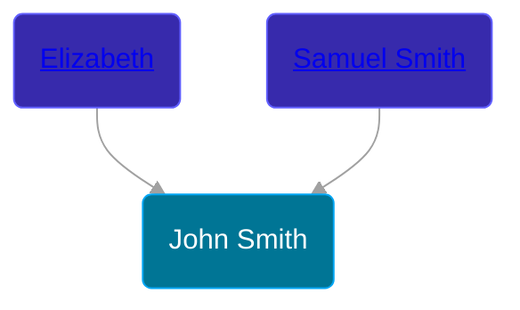

## 🔵 John Smith
<small>Age: undefined</small>

Son of [Samuel Smith](/people/8/86804391) and [Elizabeth ](/people/7/71389724)





### 📆 Events


Type | Date | Age at Event | Place
------ | ------ | ------ | ------
[Death](#event-event-2) | 30 MAY 1676 | undefined | Hatfield, Connecticut, USA



- **[Death](#event-event-2)**
**Date**: 30 MAY 1676, Age: undefined
**Place**: Hatfield, Connecticut, USA


### 📰 Event Sources

####  Death, 30 MAY 1676
* History of the Town of Sunderland, Massachusetts  - 532