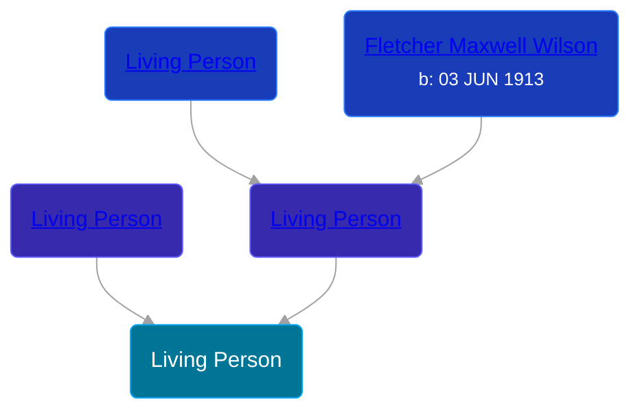

## 🟣 Living Person

Daughter of [Living Person](/people/5/53774374) and [Living Person](/people/8/88617856)



```mermaid
graph
classDef grands fill:#193cb8,stroke:#2b7fff,stroke-width:1px,color:#fff;
classDef parents fill:#372aac,stroke:#615fff,stroke-width:1px,color:#fff;
classDef primary fill:#007595,stroke:#00a6f4,stroke-width:1px,color:#fff;
8322480(Living Person):::primary
88617856(<a class="text-white" href="/people/8/88617856">Living Person</a>):::parents-->8322480
53774374(<a class="text-white" href="/people/5/53774374">Living Person</a>):::parents-->8322480
1324224(<a class="text-white" href="/people/1/1324224">Living Person</a>):::grands-->53774374
32597724(<a class="text-white" href="/people/3/32597724">Fletcher Maxwell Wilson</a><br /><small>b: 03 JUN 1913</small>):::grands-->53774374
linkStyle default stroke:#a1a1a1
```

