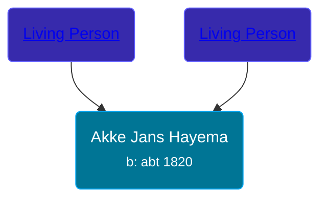

## 🟣 Akke Jans Hayema

Daughter of [Living Person](/people/4/48710710) and [Living Person](/people/3/375100)





### 📆 Events


Type | Date | Age at Event | Place
------ | ------ | ------ | ------
Birth | abt 1820 |  |



- **Birth**
**Date**: abt 1820, Age:
**Place**:


## 👩‍❤️‍👨 Relationships

### 🔵 [Tjipke Eintes Postma](/people/9/98204460), b. 03 OCT 1829

#### Events


Type | Date | Age at Event | Place
------ | ------ | ------ | ------
[Marriage](#event-family-0-event-0) | 15 MAY 1856 | 36y, 5m, 15d | Achtkarspelen, Netherlands



- **[Marriage](#event-family-0-event-0)**
**Date**: 15 MAY 1856, Age: 36y, 5m, 15d
**Place**: Achtkarspelen, Netherlands


### 📰 Event Sources

####  Marriage, 15 MAY 1856
* Dutch Civil Register
>   
  > Source Civil register - Marriage  
  > Archive location: Tresoar, Frysk Histoarysk en Letterkundich Sintrum  
  > General Number of finding aid: 30-01  
  > Item number: 2017  
  > Municipality: Achtkarspelen  
  > Type of record: Huwelijksakte  
  > Record number: 25  
  > Registration date: 15-05-1856  
  > Bridegroom: Tjipke Eintes Postma  
  > Age: 26  
  > Place of birth: Surhuisterveen  
  > Bride: Akke Jans Hayema  
  > Age: 36  
  > Place of birth: Surhuisterveen  
  > Father bridegroom: Einte Wolters Postma  
  > Mother bridegroom: Riekeltje Jakobs Wagenaar  
  > Father bride: Jan Durks Hayema  
  > Mother bride: Antje Durks Smits