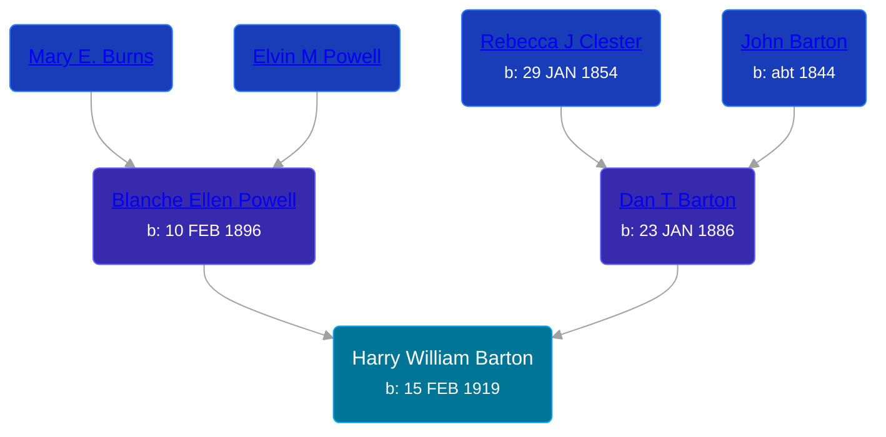

## 🔵 Harry William Barton
<small>Age: 54y, 2m, 6d</small>

Son of [Dan T Barton](/people/9/95106328) and [Blanche Ellen Powell](/people/8/88023024)





### 📆 Events


Type | Date | Age at Event | Place
------ | ------ | ------ | ------
[Birth](#event-event-2) | 15 FEB 1919 |  | Villisca, Montgomery, Iowa, USA
[Residence](#event-event-0) | 12 JAN 1920 | 10m, 27d | Jackson, Montgomery, Iowa, USA
[Residence](#event-event-1) | 19 JAN 1920 | 11m, 4d | Jackson, Montgomery, Iowa, USA
[Residence](#event-event-2) | 01 JAN 1925 | 5y, 10m, 16d | Villisca, Montgomery, Iowa, USA
[Residence](#event-event-3) | 23 APR 1930 | 11y, 2m, 8d | Tompkins Township, Jackson, Michigan, USA
[Residence](#event-event-4) | 1935 | 15y, 9m, 15d | Tompkins Township, Jackson, Michigan, USA
[Residence](#event-event-5) | 15 APR 1940 | 21y, 2m | Tompkins Township, Jackson, Michigan, USA
[Residence](#event-event-6) | 13 APR 1950 | 31y, 1m, 28d | Norvell Township, Jackson, Michigan, USA
[Death](#event-event-10) | 21 APR 1973 | 54y, 2m, 6d | Fork, Mecosta, Michigan, USA
[Burial](#event-event-11) |  |  | Hillcrest Memorial Park, Jackson, Jackson, Michigan, USA



- **[Birth](#event-event-2)**
**Date**: 15 FEB 1919, Age:
**Place**: Villisca, Montgomery, Iowa, USA
- **[Residence](#event-event-0)**
**Date**: 12 JAN 1920, Age: 10m, 27d
**Place**: Jackson, Montgomery, Iowa, USA
- **[Residence](#event-event-1)**
**Date**: 19 JAN 1920, Age: 11m, 4d
**Place**: Jackson, Montgomery, Iowa, USA
- **[Residence](#event-event-2)**
**Date**: 01 JAN 1925, Age: 5y, 10m, 16d
**Place**: Villisca, Montgomery, Iowa, USA
- **[Residence](#event-event-3)**
**Date**: 23 APR 1930, Age: 11y, 2m, 8d
**Place**: Tompkins Township, Jackson, Michigan, USA
- **[Residence](#event-event-4)**
**Date**: 1935, Age: 15y, 9m, 15d
**Place**: Tompkins Township, Jackson, Michigan, USA
- **[Residence](#event-event-5)**
**Date**: 15 APR 1940, Age: 21y, 2m
**Place**: Tompkins Township, Jackson, Michigan, USA
- **[Residence](#event-event-6)**
**Date**: 13 APR 1950, Age: 31y, 1m, 28d
**Place**: Norvell Township, Jackson, Michigan, USA
- **[Death](#event-event-10)**
**Date**: 21 APR 1973, Age: 54y, 2m, 6d
**Place**: Fork, Mecosta, Michigan, USA
- **[Burial](#event-event-11)**
**Date**:
**Place**: Hillcrest Memorial Park, Jackson, Jackson, Michigan, USA


## 👩‍❤️‍👨 Relationships

### 🟣 [Helen Mildred Densmore](/people/5/54702290), b. 15 APR 1925

#### Children With Helen Mildred Densmore
* 🟣 [Living Person](/people/9/92410091)
* 🔵 [Living Person](/people/4/42360279)
* 🔵 [Robert Elvin Barton](/people/4/48782300), b. 06 AUG 1945
* 🔵 [Richard Dale Barton](/people/8/81394146), b. 11 AUG 1949
* 🔵 [Living Person](/people/7/7769050)
### 📰 Event Sources

####  Birth, 15 FEB 1919
* Iowa, Births and Christenings Index, 1857-1947
>   
  > Name: Harry William Barton  
  > Birth Date: 15 Feb 1919  
  > Birth Place: Villisca, Montgomery, Iowa  
  > Father's Name: Dan Barton  
  > Mother's Name: Blanch Ellen Powell  
  > FHL Film Number: 1481705

####  Residence, 12 JAN 1920
* 1920 US Census

####  Residence, 19 JAN 1920
* 1920 US Census

####  Residence, 01 JAN 1925
* 1925 Iowa State Census

####  Residence, 23 APR 1930
* 1930 US Census
>   
  > Name: Harry W Barton  
  > Sex: Male  
  > Age: 11 years  
  > Birth Year (Estimated): 1919  
  > Birthplace: Iowa  
  > Marital Status: Single  
  > Race: White  
  > Relationship to Head of Household: Son  
  > Father's Birthplace: Kansas  
  > Mother's Birthplace: Iowa  
  > Event Type: Census  
  > Event Date: 1930  
  > Event Place: Tompkins, Jackson, Michigan, United States  
  > Event Place (Original): Tompkins, Jackson, Michigan, United States  
  > Line Number: 23  
  > Sheet Letter: A  
  > Sheet Number: 9  
  >   
  > Dan Barton, Head, 45, Kansas  
  > Blanche E Barton, Wife F 34, Iowa  
  > Harry W Barton, Son, 11, Iowa  
  > Elvin C Barton, Son, 10, Iowa  
  > Jean L Barton, Daughter F 9, Iowa  
  > Doris, Barton, Daughter F 6, Iowa  
  > Junior D Barton, Son, 2, Michigan  
  >

####  Residence, 1935
* 1940 US Census

####  Residence, 15 APR 1940
* 1940 US Census
>   
  > Name: Harry Barton  
  > Age: 29  
  > Estimated Birth Year: abt 1911  
  > Gender: Male  
  > Race: White  
  > Birthplace: Iowa  
  > Marital Status: Single  
  > Relation to Head of House: Son  
  > Home in 1940: Tompkins, Jackson, Michigan  
  > Map of Home in 1940:   
  > Inferred Residence in 1935: Tompkins, Jackson, Michigan  
  > Residence in 1935: Tompkins  
  > Sheet Number: 7B  
  > Father's Birthplace: Kansas  
  > Mother's Birthplace: Iowa  
  > Occupation: Laborer  
  > Attended School or College: No  
  > Highest Grade Completed: High School, 2nd year  
  > Hours Worked Week Prior to Census: 40  
  > Class of Worker: Wage or salary worker in private work  
  > Weeks Worked in 1939: 50  
  > Income: 1460  
  > Income Other Sources: No  
  > Native Language: English  
  > Social Security Number: Yes  
  > Usual Occupation: Laborer  
  > Usual Industry: Factory  
  > Usual Class of Worker: Wage or salary worker in private work  
  >   
  > Household members  
  > Dan Barton, 55  
  > Blanche Barton, 44  
  > Harry Barton, 29  
  > Alvin Barton, 20  
  > Doris Barton, 16  
  > Dan Barton, 12  
  > Anna Barton, 8  
  >

####  Residence, 13 APR 1950
* 1950 US Census
>   
  > Name: Harry W Barton  
  > Sex: Male  
  > Age: 31 years  
  > Birth Year (Estimated): 1919  
  > Birthplace: Michigan  
  > Marital Status: Married  
  > Occupation: Machine Opr  
  > Industry: Tur Rubber Factory  
  > Race: W  
  > Relationship to Head of Household: Head  
  > Event Date: 12 April 1950  
  > Event Place: Norvell, Norvell Township, Jackson, Michigan, United States  
  > Event Place (Original): Norvell, Jackson, Michigan  
  > Enumeration District: 38-122  
  > Line Number: 1  
  > Page Number: 13  
  >   
  > Harry W Barton, Head, 31 years, Michigan  
  > Helen M Barton, Wife, 24 years, Michigan  
  > Harry W Barton, Jr, Son, 5 years, Michigan  
  > Robert E Barton, Son, 4 years, Michigan  
  > Richard D Barton, Son, 0 years, Michigan

####  Death, 21 APR 1973
* U.S., Department of Veterans Affairs BIRLS Death File, 1850-2010
>   
  > Name: Harry Barton  
  > Gender: Male  
  > Birth Date: 15 Feb 1919  
  > Death Date: 21 Apr 1973  
  > Cause of Death: Natural  
  > Branch 1: ARMY  
  > Enlistment Date 1: 18 Jul 1941  
  > Release Date 1: 29 Oct 1945
* Michigan Deaths, 1971-1996
>   
  > Name:  Harry W Barton  
  > Birth Date: 15 Feb 1919  
  > Death Date: 21 Apr 1973  
  > Gender: Male  
  > Residence: Michigan  
  > Place of Death: Fork, Mecosta, Michigan
* U.S., Social Security Death Index, 1935-2014
>   
  > Name: HARRY BARTON  
  > Birth: 15 Feb 1919  
  > Death: Apr 1973  
  > Last Residence: (not specified)  
  > Last Benefit: (none specified)  
  > SSN: ###-##-####  
  > Issued: Michigan

####  Burial
* findagrave.com