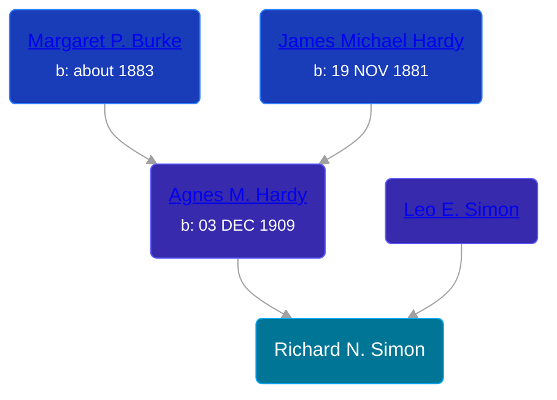

## 🔵 Richard N. Simon
<small>Age: undefined</small>

Son of [Leo E. Simon](/people/8/89858351) and [Agnes M. Hardy](/people/6/66419672)





### 📆 Events


Type | Date | Age at Event | Place
------ | ------ | ------ | ------
Death | bef 2003 | undefined |



- **Death**
**Date**: bef 2003, Age: undefined
**Place**:


