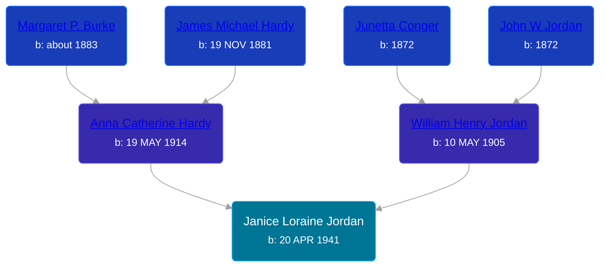

## 🟣 Janice Loraine Jordan
<small>Age: 3d</small>

Daughter of [William Henry Jordan](/people/3/32091032) and [Anna Catherine Hardy](/people/2/25919759)





### 📆 Events


Type | Date | Age at Event | Place
------ | ------ | ------ | ------
Birth | 20 APR 1941 |  | Sioux Center, Sioux, Iowa, USA
[Death](#event-event-1) | 23 APR 1941 | 3d | Sioux City, Woodbury, Iowa, USA



- **Birth**
**Date**: 20 APR 1941, Age:
**Place**: Sioux Center, Sioux, Iowa, USA
- **[Death](#event-event-1)**
**Date**: 23 APR 1941, Age: 3d
**Place**: Sioux City, Woodbury, Iowa, USA


### 📰 Event Sources

####  Death, 23 APR 1941
* Iowa, U.S., Death Records, 1880-1968
>
  > Name: Janice Loraine Jordan
  > Gender: Female
  > Race: White
  > Marital Status: Single
  > Age: 0
  > Birth Date: 20 Apr 1941
  > Birth Place: Sioux Center, Iowa
  > Death Date: 23 Apr 1941
  > Death Place: Sioux City, Woodbury, Iowa, USA
  > Father: William Jordan
  > Mother: Anna Hardy
  > Certificate Number: 97c4/1302
  >
