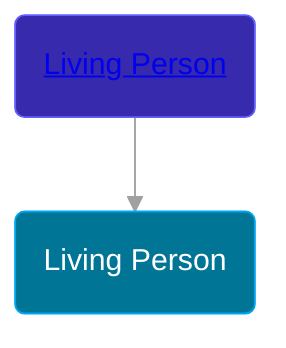

## 🔵 Living Person

Son of [Living Person](/people/8/8527359)



```mermaid
graph
classDef grands fill:#193cb8,stroke:#2b7fff,stroke-width:1px,color:#fff;
classDef parents fill:#372aac,stroke:#615fff,stroke-width:1px,color:#fff;
classDef primary fill:#007595,stroke:#00a6f4,stroke-width:1px,color:#fff;
83913800(Living Person):::primary
8527359(<a class="text-white" href="/people/8/8527359">Living Person</a>):::parents-->83913800
linkStyle default stroke:#a1a1a1
```

