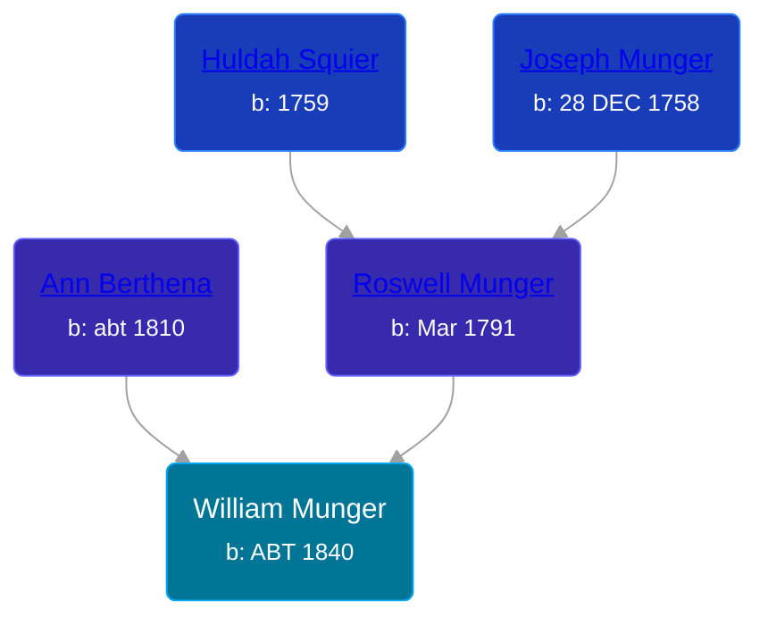

## 🔵 William Munger
<small>Age: 26y, 3m, 12d</small>

Son of [Roswell Munger](/people/2/21686617) and [Ann Berthena ](/people/9/91501676)





### 📆 Events


Type | Date | Age at Event | Place
------ | ------ | ------ | ------
Birth | ABT 1840 |  | Ohio, USA
Death | 12 MAR 1866 | 26y, 3m, 12d |
Burial |  |  | LaGrange Cemetery, LaGrange, Lorain, Ohio, USA



- **Birth**
**Date**: ABT 1840, Age:
**Place**: Ohio, USA
- **Death**
**Date**: 12 MAR 1866, Age: 26y, 3m, 12d
**Place**:
- **Burial**
**Date**:
**Place**: LaGrange Cemetery, LaGrange, Lorain, Ohio, USA

