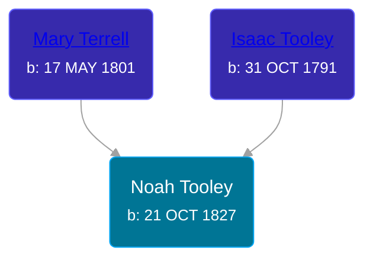

## 🔵 Noah Tooley
<small>Age: 82y, 2m, 17d</small>

Son of [Isaac Tooley](/people/6/65071054) and [Mary Terrell](/people/3/36199064)





### 📆 Events


Type | Date | Age at Event | Place
------ | ------ | ------ | ------
Birth | 21 OCT 1827 |  | New York, USA
[Residence](#event-event-0) | 07 SEP 1850 | 22y, 10m, 16d | Royalton, Niagra, New York, USA
[Residence](#event-event-1) | 23 JUN 1860 | 32y, 8m, 2d | Paris Township, Kent, Michigan, USA
[Residence](#event-event-2) | 01 JUL 1863 | 35y, 8m, 10d | Paris Township, Kent, Michigan, USA
[Residence](#event-event-3) | 12 AUG 1870 | 42y, 9m, 21d | Paris Township, Kent, Michigan, USA
[Residence](#event-event-4) | 1880 | 52y, 1m, 9d | Paris Township, Kent, Michigan, USA
[Residence](#event-event-5) | 04 JUN 1900 | 72y, 7m, 13d | Paris Township, Kent, Michigan, USA
[Death](#event-event-9) | 08 JAN 1910 | 82y, 2m, 17d | Paris Township, Kent, Michigan, USA
[Burial](#event-event-10) |  |  | Oak Grove Cemetery, Grand Rapids, Kent, Michigan, United States



- **Birth**
**Date**: 21 OCT 1827, Age:
**Place**: New York, USA
- **[Residence](#event-event-0)**
**Date**: 07 SEP 1850, Age: 22y, 10m, 16d
**Place**: Royalton, Niagra, New York, USA
- **[Residence](#event-event-1)**
**Date**: 23 JUN 1860, Age: 32y, 8m, 2d
**Place**: Paris Township, Kent, Michigan, USA
- **[Residence](#event-event-2)**
**Date**: 01 JUL 1863, Age: 35y, 8m, 10d
**Place**: Paris Township, Kent, Michigan, USA
- **[Residence](#event-event-3)**
**Date**: 12 AUG 1870, Age: 42y, 9m, 21d
**Place**: Paris Township, Kent, Michigan, USA
- **[Residence](#event-event-4)**
**Date**: 1880, Age: 52y, 1m, 9d
**Place**: Paris Township, Kent, Michigan, USA
- **[Residence](#event-event-5)**
**Date**: 04 JUN 1900, Age: 72y, 7m, 13d
**Place**: Paris Township, Kent, Michigan, USA
- **[Death](#event-event-9)**
**Date**: 08 JAN 1910, Age: 82y, 2m, 17d
**Place**: Paris Township, Kent, Michigan, USA
- **[Burial](#event-event-10)**
**Date**:
**Place**: Oak Grove Cemetery, Grand Rapids, Kent, Michigan, United States


## 👩‍❤️‍👨 Relationships

### 🟣 [Lydia E. Dexter](/people/6/67357568), b. 15 AUG 1826

#### Children With Lydia E. Dexter
* 🟣 [Mary Ida Tooley](/people/5/52009861), b. 19 MAR 1850
* 🔵 [Robert S. Tooley](/people/4/49267584), b. 05 OCT 1853
* 🔵 [Louis J. Tooley](/people/9/93438030), b. abt 1855
* 🟣 [Eunice Emma Tooley](/people/9/90896235), b. 22 AUG 1858
* 🟣 [Nettie M. Tooley](/people/6/61920568), b. 27 OCT 1866
### 📰 Event Sources

####  Residence, 07 SEP 1850
* 1850 US Census

####  Residence, 23 JUN 1860
* 1860 US Census

####  Residence, 01 JUL 1863
* U.S., Civil War Draft Registrations Records, 1863-1865

####  Residence, 12 AUG 1870
* 1870 US Census

####  Residence, 1880
* 1880 US Census

####  Residence, 04 JUN 1900
* 1900 US Census

####  Death, 08 JAN 1910
* Michigan, Death Records, 1867-1950
>   
  > Name: Noah Tooley  
  > Gender: Male  
  > Race: White  
  > Marital Status: Widowed  
  > Death Age: 82  
  > Birth Date: 21 Oct 1827  
  > Birth Place: New York  
  > Death Date: 8 Jan 1910  
  > Death Place: Paris, Kent, Michigan, USA  
  > Father: Isaac Tooley  
  > Mother: Mary Terrill
* Kent County Death Records
>   
  > Name: Noah Tooley  
  > Date of Death: 8 Jan 1910  
  > Date of Record: 5 Feb 1910  
  > Age: 82y 2m 18d  
  > Place of Death: Paris Township  
  > Cause: Gangrene of the Foot  
  > Born: New York  
  > Occupation: Farmer  
  > Parents: Isaac Tooley (Vermont) and Mary Terrell (Massachusetts)

####  Burial
* findagrave.com
