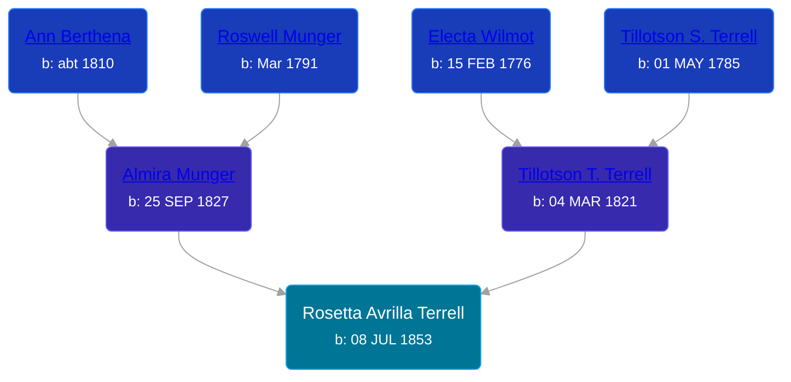

## 🟣 Rosetta Avrilla Terrell
<small>Age: 70y, 1m, 23d</small>

Daughter of [Tillotson T. Terrell](/people/5/59687792) and [Almira Munger](/people/3/36419408)





### 📆 Events


Type | Date | Age at Event | Place
------ | ------ | ------ | ------
Birth | 08 JUL 1853 |  |
[Residence](#event-event-0) | 28 JUN 1860 | 6y, 11m, 20d | Byron Township, Kent, Michigan, USA
[Residence](#event-event-1) | 16 AUG 1870 | 17y, 1m, 8d | Paris Township, Kent, Michigan, USA
[Death](#event-event-5) | 01 SEP 1923 | 70y, 1m, 23d | Elmira Township, Otsego, Michigan, USA



- **Birth**
**Date**: 08 JUL 1853, Age:
**Place**:
- **[Residence](#event-event-0)**
**Date**: 28 JUN 1860, Age: 6y, 11m, 20d
**Place**: Byron Township, Kent, Michigan, USA
- **[Residence](#event-event-1)**
**Date**: 16 AUG 1870, Age: 17y, 1m, 8d
**Place**: Paris Township, Kent, Michigan, USA
- **[Death](#event-event-5)**
**Date**: 01 SEP 1923, Age: 70y, 1m, 23d
**Place**: Elmira Township, Otsego, Michigan, USA


### 📰 Event Sources

####  Residence, 28 JUN 1860
* 1860 US Census

####  Residence, 16 AUG 1870
* 1870 US Census

####  Death, 01 SEP 1923
* Michigan, Deaths and Burials Index, 1867-1995
>   
  > Name: Rosette Shafer  
  > [Rosette Ferrill]  
  > Birth Date: abt 1853  
  > Birth Place: Ohio  
  > Death Date: 1 Sep 1923  
  > Death Place: Elmira, Otsego, Michigan  
  > Death Age: 70  
  > Race: White  
  > Marital Status: Widowed  
  > Gender: Female  
  > Father Name: Teeltson Ferrill  
  > Mother Name: Myra Munger  
  > FHL Film Number: 965765
