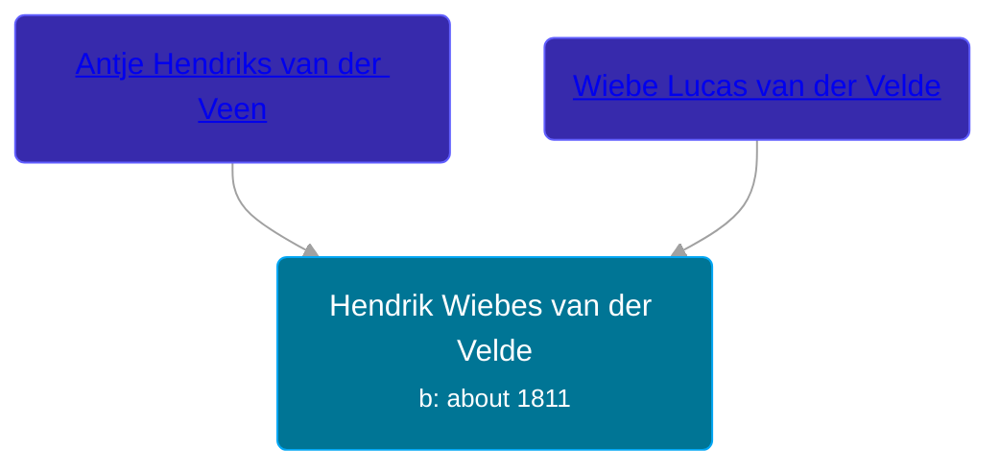

## 🔵 Hendrik Wiebes van der Velde

Son of [Wiebe Lucas van der Velde](/people/9/9294160) and [Antje Hendriks van der Veen](/people/4/48633974)





### 📆 Events


Type | Date | Age at Event | Place
------ | ------ | ------ | ------
Birth | about 1811 |  | Tolbert, Netherlands



- **Birth**
**Date**: about 1811, Age:
**Place**: Tolbert, Netherlands


## 👩‍❤️‍👨 Relationships

### 🟣 [Renske Ruurts Veltman](/people/6/61029791), b. about 1811

#### Events


Type | Date | Age at Event | Place
------ | ------ | ------ | ------
[Marriage](#event-family-0-event-0) | 28 JUN 1835 | 24y, 6m, 28d | Leek, Netherlands



- **[Marriage](#event-family-0-event-0)**
**Date**: 28 JUN 1835, Age: 24y, 6m, 28d
**Place**: Leek, Netherlands


### 📰 Event Sources

####  Marriage, 28 JUN 1835
* Dutch Civil Register
>   
  > Source Civil register - Marriage  
  > Archive location: Groninger Archieven  
  > GeneralMunicipality: Leek  
  > Type of record: Huwelijksakte  
  > Record number: 18  
  > Registration date: 28-06-1835  
  > Bridegroom: Hendrik Wiebes van der Velde  
  > Place of birth: Nuis  
  > Bride: Renske Ruurts Veltman  
  > Place of birth: Tolbert  
  > Father bridegroom: Wiebe Lucas van der Velde  
  > Mother bridegroom: Antje Hendriks van der Veen  
  > Father bride: Ruurt Jans Veltman  
  > Mother bride: Trientje Gerhardus de Vries  
  > Additional information: beroep bruidegom: arbeider; beroep bruid: arbeidster; beroep vader bruidegom.: arbeider; beroep vader bruid: arbeider; bruidegom 24 jaar; bruid 24 jaar