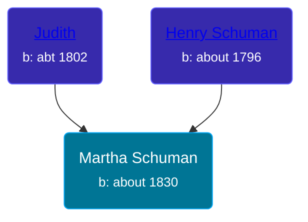

## 🟣 Martha Schuman

Daughter of [Henry Schuman](/people/6/6084048) and [Judith ](/people/9/94900602)





### 📆 Events


Type | Date | Age at Event | Place
------ | ------ | ------ | ------
Birth | about 1830 |  | Pennsylvania, USA
[Residence](#event-event-0) | 22 AUG 1850 | 20y, 8m, 22d | Concord Township, Miami, Ohio, USA



- **Birth**
**Date**: about 1830, Age:
**Place**: Pennsylvania, USA
- **[Residence](#event-event-0)**
**Date**: 22 AUG 1850, Age: 20y, 8m, 22d
**Place**: Concord Township, Miami, Ohio, USA


### 📰 Event Sources

####  Residence, 22 AUG 1850
* 1850 US Census
