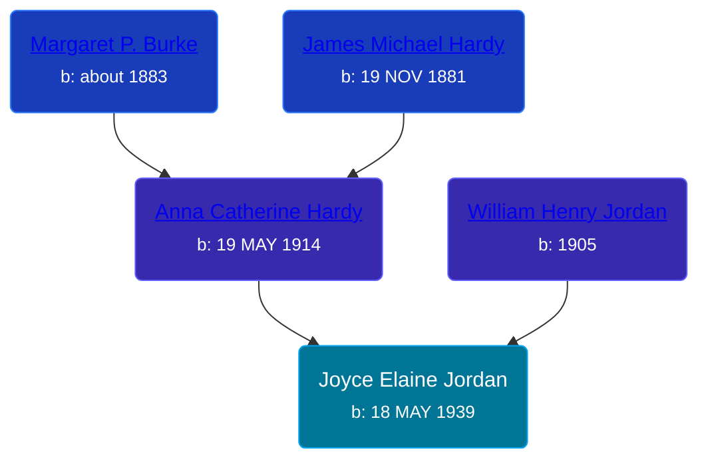

## 🟣 Joyce Elaine Jordan
<small>Age: 49y, 9m, 9d</small>

Daughter of [William Henry Jordan](/people/3/32091032) and [Anna Catherine Hardy](/people/2/25919759)





### 📆 Events


Type | Date | Age at Event | Place
------ | ------ | ------ | ------
Birth | 18 MAY 1939 |  | Iowa, USA
[Residence](#event-event-0) | 18 APR 1940 | 11m | Sioux City, Woodbury, Iowa, USA
[Death](#event-event-4) | 27 FEB 1989 | 49y, 9m, 9d | Sacramento, California, USA
[Burial](#event-event-5) |  |  | Calvary Cemetery, Sioux City, Woodbury, Iowa, USA



- **Birth**
**Date**: 18 MAY 1939, Age:
**Place**: Iowa, USA
- **[Residence](#event-event-0)**
**Date**: 18 APR 1940, Age: 11m
**Place**: Sioux City, Woodbury, Iowa, USA
- **[Death](#event-event-4)**
**Date**: 27 FEB 1989, Age: 49y, 9m, 9d
**Place**: Sacramento, California, USA
- **[Burial](#event-event-5)**
**Date**:
**Place**: Calvary Cemetery, Sioux City, Woodbury, Iowa, USA


## 👩‍❤️‍👨 Relationships

### 🔵 [Living Person](/people/2/24894772)

### 📰 Event Sources

####  Residence, 18 APR 1940
* 1940 US Census

####  Death, 27 FEB 1989
* California, Death Index, 1940-1997

####  Burial
* findagrave.com
