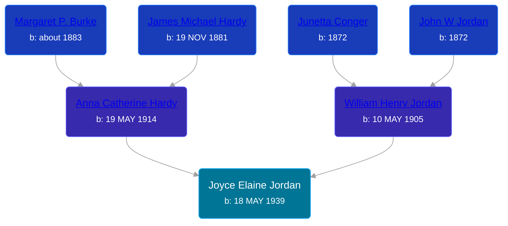

## 🟣 Joyce Elaine Jordan
<small>Age: 49y, 9m, 9d</small>

Daughter of [William Henry Jordan](/people/3/32091032) and [Anna Catherine Hardy](/people/2/25919759)



```mermaid
graph
classDef grands fill:#193cb8,stroke:#2b7fff,stroke-width:1px,color:#fff;
classDef parents fill:#372aac,stroke:#615fff,stroke-width:1px,color:#fff;
classDef primary fill:#007595,stroke:#00a6f4,stroke-width:1px,color:#fff;
86240475(Joyce Elaine Jordan<br /><small>b: 18 MAY 1939</small>):::primary
25919759(<a class="text-white" href="/people/2/25919759">Anna Catherine Hardy</a><br /><small>b: 19 MAY 1914</small>):::parents-->86240475
29782872(<a class="text-white" href="/people/2/29782872">Margaret P. Burke</a><br /><small>b: about 1883</small>):::grands-->25919759
11204316(<a class="text-white" href="/people/1/11204316">James Michael Hardy</a><br /><small>b: 19 NOV 1881</small>):::grands-->25919759
32091032(<a class="text-white" href="/people/3/32091032">William Henry Jordan</a><br /><small>b: 10 MAY 1905</small>):::parents-->86240475
55321016(<a class="text-white" href="/people/5/55321016">Junetta Conger</a><br /><small>b: 1872</small>):::grands-->32091032
97595723(<a class="text-white" href="/people/9/97595723">John W Jordan</a><br /><small>b: 1872</small>):::grands-->32091032
linkStyle default stroke:#a1a1a1
```


### 📆 Events


Type | Date | Age at Event | Place
------ | ------ | ------ | ------
Birth | 18 MAY 1939 |  | Iowa, USA
[Residence](#event-event-1) | 18 APR 1940 | 11m | Sioux City, Woodbury, Iowa, USA
[Residence](#event-event-2) | 04 APR 1950 | 10y, 10m, 17d | Sioux City, Woodbury, Iowa, USA
[Death](#event-event-3) | 27 FEB 1989 | 49y, 9m, 9d | Sacramento, California, USA
[Burial](#event-event-4) |  |  | Calvary Cemetery, Sioux City, Woodbury, Iowa, USA



- **Birth**
**Date**: 18 MAY 1939, Age:
**Place**: Iowa, USA
- **[Residence](#event-event-1)**
**Date**: 18 APR 1940, Age: 11m
**Place**: Sioux City, Woodbury, Iowa, USA
- **[Residence](#event-event-2)**
**Date**: 04 APR 1950, Age: 10y, 10m, 17d
**Place**: Sioux City, Woodbury, Iowa, USA
- **[Death](#event-event-3)**
**Date**: 27 FEB 1989, Age: 49y, 9m, 9d
**Place**: Sacramento, California, USA
- **[Burial](#event-event-4)**
**Date**:
**Place**: Calvary Cemetery, Sioux City, Woodbury, Iowa, USA


## 👩‍❤️‍👨 Relationships

### 🔵 [Living Person](/people/2/24894772)

### 📰 Event Sources

####  Residence, 18 APR 1940
* 1940 US Census

####  Residence, 04 APR 1950
* 1950 US Census
>
  > Name: Joyce Elaine Jordan
  > Age: 10
  > Birth Date: abt 1940
  > Gender: Female
  > Race: White
  > Birth Place: Iowa
  > Marital Status: Never Married (Single)
  > Relation to Head of House: Daughter
  > Residence Date: 1950
  > Home in 1950: Sioux City, Woodbury, Iowa, USA
  > Street Name: 10th St
  > House Number: 210
  > Dwelling Number: 245
  > Farm: No
  > Acres: No
  > Occupation Category: Other
  > Worked Last Week: No
  > Seeking Work: No
  > Employment Status: No
  >
  > Household members:
  > - William H Jordan, 45, Head
  > - Anna C Jordan, 35, Wife
  > - Robert E Jordan, 18, Son
  > - Mary Anne Jordan, 15, Daughter
  > - Patricia J Jordan, 14, Daughter
  > - Margaret C Jordan, 12, Daughter
  > - Joyce Elaine Jordan, 10, Daughter
  >

####  Death, 27 FEB 1989
* California, Death Index, 1940-1997

####  Burial
* findagrave.com
