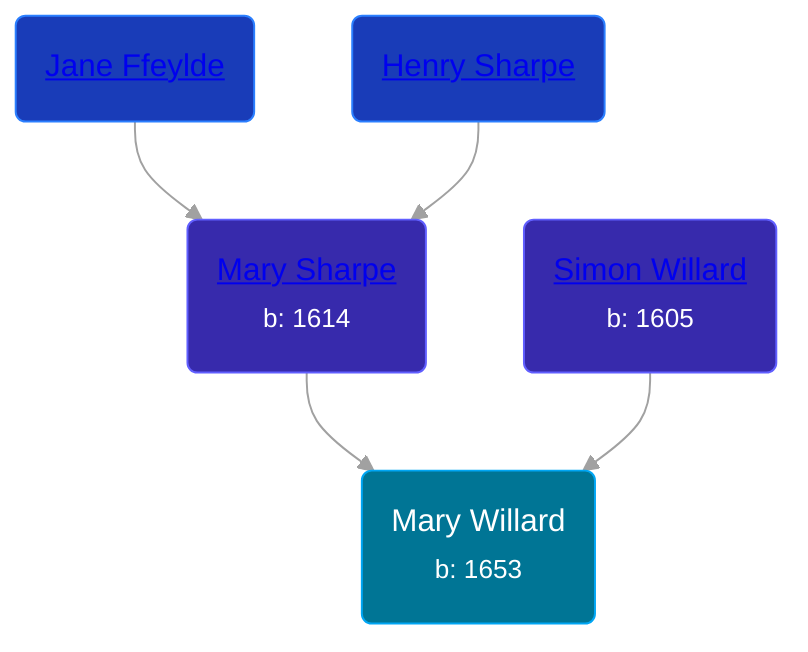

## 🔵 Mary Willard

Son of [Simon Willard](/people/8/86485776) and [Mary Sharpe](/people/1/10735316)





### 📆 Events


Type | Date | Age at Event | Place
------ | ------ | ------ | ------
[Birth](#event-event-2) | 1653 |  |



- **[Birth](#event-event-2)**
**Date**: 1653, Age:
**Place**:


### 📰 Event Sources

####  Birth, 1653
* Willard Memoir: Sketch of the Life of Maj. Simon Willard  - 4