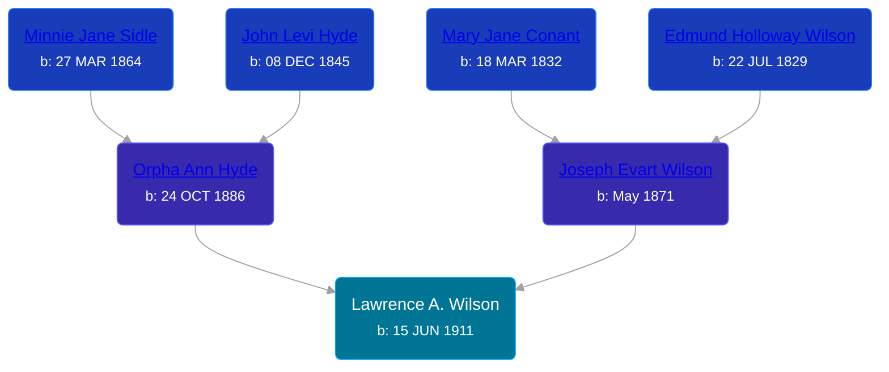

## 🔵 Lawrence A. Wilson
<small>Age: 81y, 7m, 13d</small>

Son of [Joseph Evart Wilson](/people/5/57306025) and [Orpha Ann Hyde](/people/6/63932813)





### 📆 Events


Type | Date | Age at Event | Place
------ | ------ | ------ | ------
[Birth](#event-event-2) | 15 JUN 1911 |  | Grant, Newaygo, Michigan, USA
[Residence](#event-event-0) | 07 JAN 1920 | 8y, 6m, 22d | Grand Rapids, Kent, Michigan, United States
[Residence](#event-event-1) | 1930 | 18y, 5m, 15d | Grand Rapids, Kent, Michigan, United States
[Residence](#event-event-2) | 1940 | 28y, 5m, 15d | South Haven, Van Buren, Michigan, USA
[Death](#event-event-6) | 28 JAN 1993 | 81y, 7m, 13d | Grand Rapids, Kent, Michigan, United States



- **[Birth](#event-event-2)**
**Date**: 15 JUN 1911, Age:
**Place**: Grant, Newaygo, Michigan, USA
- **[Residence](#event-event-0)**
**Date**: 07 JAN 1920, Age: 8y, 6m, 22d
**Place**: Grand Rapids, Kent, Michigan, United States
- **[Residence](#event-event-1)**
**Date**: 1930, Age: 18y, 5m, 15d
**Place**: Grand Rapids, Kent, Michigan, United States
- **[Residence](#event-event-2)**
**Date**: 1940, Age: 28y, 5m, 15d
**Place**: South Haven, Van Buren, Michigan, USA
- **[Death](#event-event-6)**
**Date**: 28 JAN 1993, Age: 81y, 7m, 13d
**Place**: Grand Rapids, Kent, Michigan, United States


## 👩‍❤️‍👨 Relationships

### 🟣 [Maude Van Valkenburg](/people/4/43859609), b. 04 MAY 1911

#### Events


Type | Date | Age at Event | Place
------ | ------ | ------ | ------
[Marriage](#event-family-0-event-0) | 11 FEB 1932 | 20y, 7m, 26d | Grand Rapids, Kent, Michigan, United States



- **[Marriage](#event-family-0-event-0)**
**Date**: 11 FEB 1932, Age: 20y, 7m, 26d
**Place**: Grand Rapids, Kent, Michigan, United States


#### Children With Maude Van Valkenburg
* 🟣 [Living Person](/people/1/19809296)
* 🔵 [Living Person](/people/4/44847084)
### 📰 Event Sources

####  Birth, 15 JUN 1911
* Michigan, U.S., Birth Records, 1867-1914
>   
  > Name: Lawrence Wilson  
  > Gender: Male  
  > Birth Date: 15 Jun 1911  
  > Birth Place: Grant, Michigan, USA  
  > Father: Joseph Wilson  
  > Mother: Orpha Hyde  
  > Jurisdiction Number: 212-433  
  > Reference Number: Vol 39E  
  >

####  Residence, 07 JAN 1920
* 1920 US Census
>   
  > Name: Lawrence Wilson  
  > Age: 8  
  > Birth Year: abt 1912  
  > Birthplace: Michigan  
  > Home in 1920: Grand Rapids Ward 2, Kent, Michigan  
  > Street: Taylor Ave  
  > Residence Date: 1920  
  > Race: White  
  > Gender: Male  
  > Relation to Head of House: Son  
  > Marital Status: Single  
  > Father's Name: Orpha Wilson  
  > Father's Birthplace: Michigan  
  > Mother's Birthplace: Michigan  
  > Attended School: yes  
  >   
  > Household members:  
  > Orpha Wilson, 33, Head  
  > Joseph Wilson, 13, Son  
  > Lawrence Wilson, 8, Son  
  > Maxwell Wilson, 6, Son

####  Residence, 1930
* 1930 US Census

####  Marriage, 11 FEB 1932
* Michigan, Marriage Records, 1867-1952
>   
  > Name: Maude Van Valkenburg  
  > Gender: Female  
  > Race: White  
  > Birth Year: abt 1912  
  > Birth Place: Grand Rapids  
  > Marriage Date: 11 Feb 1932  
  > Marriage Place: Grand Rapids, Kent, Michigan, USA  
  > License County: Kent  
  > Age: 20  
  > Residence Place: Grand Rapids  
  > Father: Jacob Van Valkenburg  
  > Mother: Gertrude Van Laar  
  > Spouse: Lawrence Wilson  
  > Gender: Male  
  > Race: White  
  > Birth Year: abt 1912  
  > Birth Place: Tyrone Twp Kent Co, Michigan  
  > Age: 20  
  > Residence Place: Grand Rapids  
  > Father: Joseph Wilson  
  > Mother: Orpha Hyde  
  > County File Number: 267  
  > State File Number: 41 11271  
  > Film: 112  
  > Film Title: 41 Kent 9300-12539  
  > Film Description: Kent (1930 - 1933)

####  Residence, 1940
* 1940 US Census
####  Death, 28 JAN 1993
* Michigan Deaths, 1971-1996
>   
  > Name:  Lawrence A. Wilson  
  > Birth Date: 15 Jun 1911  
  > Death Date: 28 Jan 1993  
  > Gender: Male  
  > Residence: Grand Rapids, Kent, Michigan  
  > Place of Death: Grand Rapids, Kent, Michigan
* U.S., Social Security Death Index, 1935-2014
>   
  > Name: LAWRENCE A WILSON  
  > Birth: 15 Jun 1911  
  > Death: 28 Jan 1993  
  > Last Residence: 49505 (Grand Rapids, Kent, MI)  
  > Last Benefit: (none specified)  
  > SSN: ###-##-####  
  > Issued: Michigan
* The Grand Rapids Press
>   
  > WILSON -- Mr. Lawrence A. Wilson, aged 81, passed away Thursday, January 28, 1992 at St. Mary's Hospital. He is survived by his children, Patricia and Louis Thomas of Comstock Park, James and Norma Wilson of Grand Rapids; five grandchildren, Michael (Janet) Thomas, Louis M. Thomas, David (Cindy) Thomas, Larry (Nan) Wilson, Tom (Meg) Wilson; ten great-grandchildren; his brother, Fletcher "Max" (Beatrice) Wilson of Florida; his sister, Laura (Andrew) Cree of Grand Rapids; and several nieces and nephews. He was preceded in death by his wife, Maude. Mr. Wilson was a former co-owner of Wilson Trucking Company. Funeral services will be held Monday at 11:00 a.m. at the Van'T Hof Chapel with interment in Chapel Hill Memorial Gardens.
