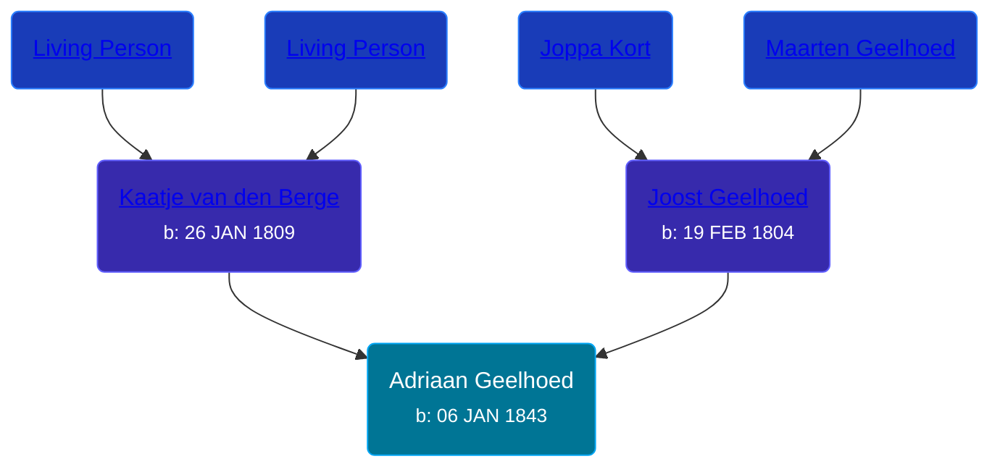

## 🔵 Adriaan Geelhoed
<small>Age: 76y, 1m, 3d</small>

Son of [Joost Geelhoed](/people/7/72031888) and [Kaatje van den Berge](/people/3/32271874)





### 📆 Events


Type | Date | Age at Event | Place
------ | ------ | ------ | ------
[Birth](#event-event-2) | 06 JAN 1843 |  | Dreischor, Zeeland, Netherlands
[Death](#event-event-3) | 09 FEB 1919 | 76y, 1m, 3d | Grand Rapids, Kent, Michigan, United States



- **[Birth](#event-event-2)**
**Date**: 06 JAN 1843, Age:
**Place**: Dreischor, Zeeland, Netherlands
- **[Death](#event-event-3)**
**Date**: 09 FEB 1919, Age: 76y, 1m, 3d
**Place**: Grand Rapids, Kent, Michigan, United States


### 📰 Event Sources

####  Birth, 06 JAN 1843
* Geelhoet, Geelhoed & Geelhoedt Genealogie

####  Death, 09 FEB 1919
* Geelhoet, Geelhoed & Geelhoedt Genealogie