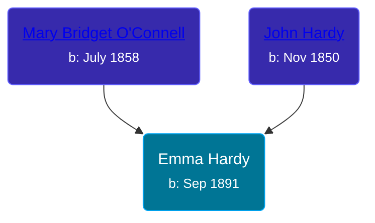

## 🟣 Emma Hardy

Daughter of [John Hardy](/people/5/56182816) and [Mary Bridget O'Connell](/people/4/47047024)





### 📆 Events


Type | Date | Age at Event | Place
------ | ------ | ------ | ------
Birth | Sep 1891 |  | Nebraska, USA
[Residence](#event-event-0) | 04 JUN 1900 | 8y, 9m, 4d | Omaha, Douglas, Nebraska, USA



- **Birth**
**Date**: Sep 1891, Age:
**Place**: Nebraska, USA
- **[Residence](#event-event-0)**
**Date**: 04 JUN 1900, Age: 8y, 9m, 4d
**Place**: Omaha, Douglas, Nebraska, USA


### 📰 Event Sources

####  Residence, 04 JUN 1900
* 1900 US Census
