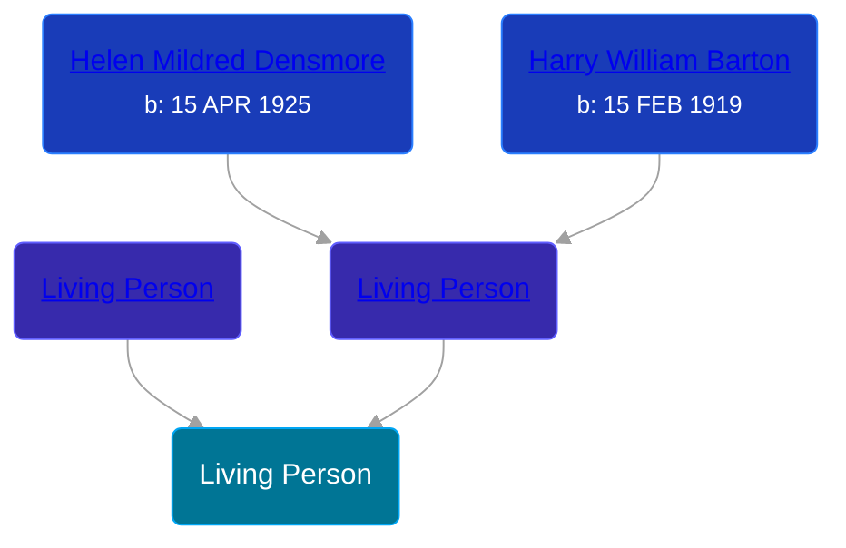

## 🔵 Living Person

Son of [Living Person](/people/7/7769050) and [Living Person](/people/3/37411948)





## 👩‍❤️‍👨 Relationships

### ⚪ Unknown Person

#### Children With Unknown Person
* 🔵 [Living Person](/people/2/20123685)