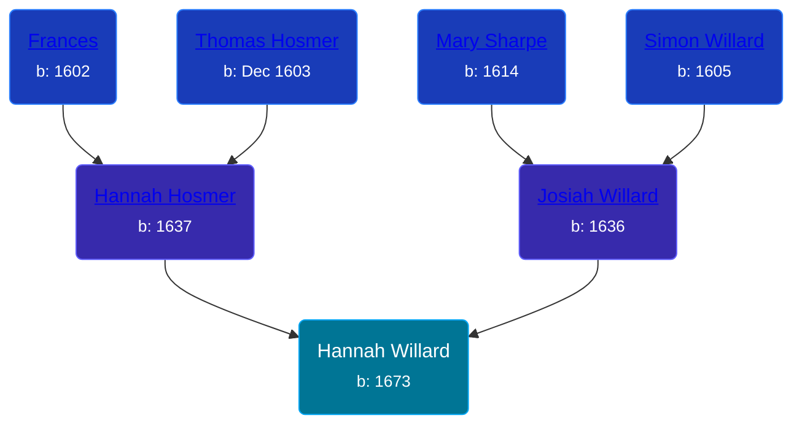

## 🟣 Hannah Willard

Daughter of [Josiah Willard](/people/5/55775674) and [Hannah Hosmer](/people/7/74814464)





### 📆 Events


Type | Date | Age at Event | Place
------ | ------ | ------ | ------
[Birth](#event-event-2) | 1673 |  | Wethersfield, Connecticut, USA



- **[Birth](#event-event-2)**
**Date**: 1673, Age:
**Place**: Wethersfield, Connecticut, USA


### 📰 Event Sources

####  Birth, 1673
* Register of the Society of Colonial Wars in the District of Columbia  - 64
* Hall Ancestry: A series of Sketches of the Lineal Ancestors  - 168