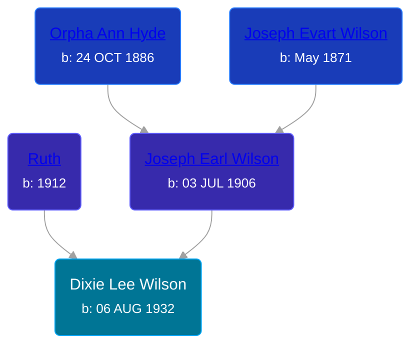

## 🟣 Dixie Lee Wilson
<small>Age: 53y, 9m, 6d</small>

Daughter of [Joseph Earl Wilson](/people/3/35616804) and [Ruth ](/people/7/72945090)





### 📆 Events


Type | Date | Age at Event | Place
------ | ------ | ------ | ------
Birth | 06 AUG 1932 |  | Michigan, USA
[Residence](#event-event-0) | 1940 | 7y, 3m, 24d | Grand Rapids, Kent, Michigan, United States
[Death](#event-event-4) | 12 MAY 1986 | 53y, 9m, 6d | Grand Rapids, Kent, Michigan, United States



- **Birth**
**Date**: 06 AUG 1932, Age:
**Place**: Michigan, USA
- **[Residence](#event-event-0)**
**Date**: 1940, Age: 7y, 3m, 24d
**Place**: Grand Rapids, Kent, Michigan, United States
- **[Death](#event-event-4)**
**Date**: 12 MAY 1986, Age: 53y, 9m, 6d
**Place**: Grand Rapids, Kent, Michigan, United States


## 👩‍❤️‍👨 Relationships

### 🔵 [Living Person](/people/4/45880759)

#### Children With Living Person
* 🔵 [Living Person](/people/8/83254504)
* 🔵 [Living Person](/people/4/49618909)
* 🔵 [Living Person](/people/5/57708032)
* 🔵 [Living Person](/people/5/59170178)
### 🔵 [William Kenneth Augustine](/people/6/67055724), b. 06 JUL 1932

#### Children With William Kenneth Augustine
* 🔵 [Living Person](/people/1/12835222)
* 🟣 [Living Person](/people/6/69397775)
### 📰 Event Sources

####  Residence, 1940
* 1940 US Census

####  Death, 12 MAY 1986
* Michigan Deaths, 1971-1996
>   
  > Name:  Dixie L Augustine  
  > Birth Date: 6 Aug 1932  
  > Death Date: 12 May 1986  
  > Gender: Female  
  > Residence: Cannon, Kent, Michigan  
  > Place of Death: Grand Rapids, Kent, Michigan
* The Grand Rapids Press
>   
  > AUGUSTINE -- Mrs. Dixie Lee Augustine, aged 53, of Ada, died Monday afternoon, May 12, 1986. Mrs. Augustine is survived by her husband, William K. Augustine; her mother, Ruth Wilson; her sisters and brother, Joy Orosz, June Bowman, and Gary Wilson; her sons and daughters, Raymond Storey, Ricky Storey, Graig Storey, Clifford Storey, Dawn Orr, Ruth Augustine, and Kenneth Augustine; her step-sons and daughters, David Augustine, Linda Augustine, Joan Augustine, William L. Augustine, and Kathy Augustine; 16 grandchildren; her mother-in-law and father-in-law, Luther and Ellen Augustine; several nieces and nephews.
* U.S., Social Security Death Index, 1935-2014
>   
  > Name: DIXIE AUGUSTINE  
  > Birth: 06 Aug 1932  
  > Death: May 1986  
  > Last Residence: (not specified)  
  > Last Benefit: 49301 (Ada, Kent, MI)  
  > SSN: ###-##-####  
  > Issued: Michigan
