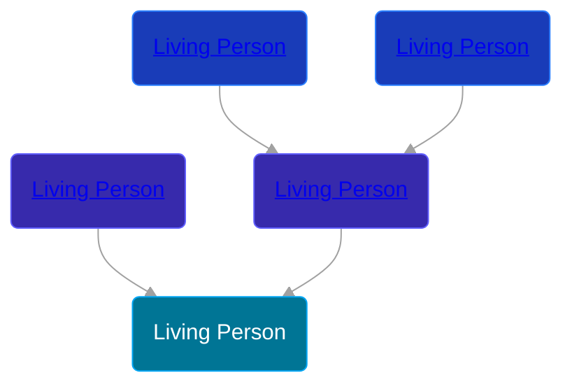

## 🟣 Living Person

Daughter of [Living Person](/people/1/11913320) and [Living Person](/people/4/44129601)



```mermaid
graph
classDef grands fill:#193cb8,stroke:#2b7fff,stroke-width:1px,color:#fff;
classDef parents fill:#372aac,stroke:#615fff,stroke-width:1px,color:#fff;
classDef primary fill:#007595,stroke:#00a6f4,stroke-width:1px,color:#fff;
87584808(Living Person):::primary
44129601(<a class="text-white" href="/people/4/44129601">Living Person</a>):::parents-->87584808
11913320(<a class="text-white" href="/people/1/11913320">Living Person</a>):::parents-->87584808
27090454(<a class="text-white" href="/people/2/27090454">Living Person</a>):::grands-->11913320
28832046(<a class="text-white" href="/people/2/28832046">Living Person</a>):::grands-->11913320
linkStyle default stroke:#a1a1a1
```

