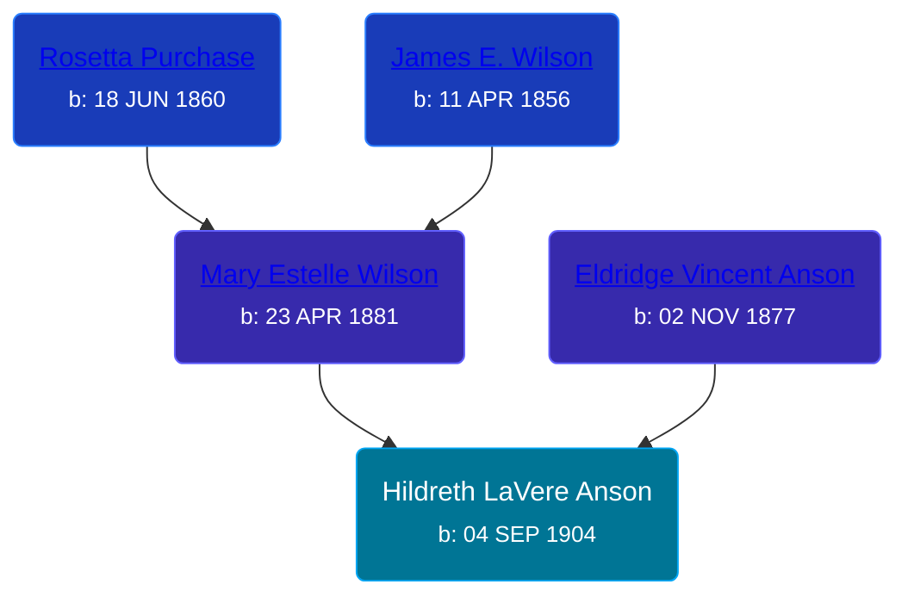

## 🔵 Hildreth LaVere Anson
<small>Age: 77y, 3m, 18d</small>

Son of [Eldridge Vincent Anson](/people/2/29601540) and [Mary Estelle Wilson](/people/4/46787428)





### 📆 Events


Type | Date | Age at Event | Place
------ | ------ | ------ | ------
Birth | 04 SEP 1904 |  |
[Death](#event-event-3) | 22 DEC 1981 | 77y, 3m, 18d |
Burial |  |  | Dublin Cemetery, Wellston, Michigan, USA



- **Birth**
**Date**: 04 SEP 1904, Age:
**Place**:
- **[Death](#event-event-3)**
**Date**: 22 DEC 1981, Age: 77y, 3m, 18d
**Place**:
- **Burial**
**Date**:
**Place**: Dublin Cemetery, Wellston, Michigan, USA


## 👩‍❤️‍👨 Relationships

### ⚪ Unknown Person

#### Events


Type | Date | Age at Event | Place
------ | ------ | ------ | ------
Marriage | 26 OCT 1926 | 22y, 1m, 22d | Peacock, Lake, Michigan, USA



- **Marriage**
**Date**: 26 OCT 1926, Age: 22y, 1m, 22d
**Place**: Peacock, Lake, Michigan, USA


### 📰 Event Sources

####  Marriage, 26 OCT 1926

####  Death, 22 DEC 1981
* The Grand Rapids Press  - 25 Dec 1981
>   
  > ANSON -- Mr. Hildreth L., aged 77, of Wellston, MI, passed away Tuesday Dec. 22, 1981. He is survived by two sons, Charles of Adrian and Clarence of Harbor Beach; six grandchildren, seven great grandchildren; two half-brothers, Anson (Vern) Whitting of Muskegon and James Whiting of Rockford; numerous nieces and nephews. He was preceeded in death by his wife Inez in 1981. Graveside Services will be Saturday Dec 26 at 2PM at the Dublin Cemeter, Wellston, MI with Rev. Lester McClelland offficiating. The family will be at the Terwilliger Funeral Home in Kaleva, MI, Saturday 10am-1pm.
