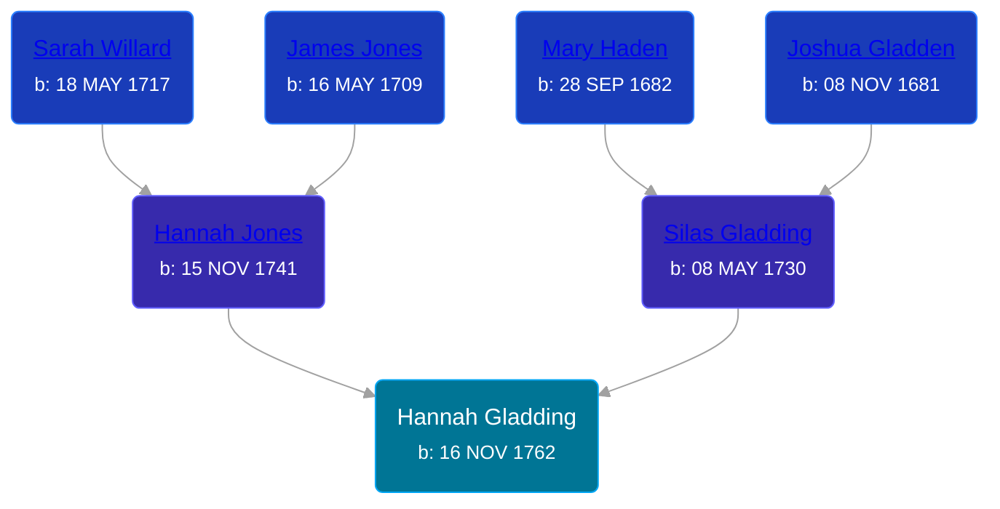

## 🟣 Hannah Gladding
<small>Age: 81y, 1m, 8d</small>

Daughter of [Silas Gladding](/people/5/55129348) and [Hannah Jones](/people/3/3592220)





### 📆 Events


Type | Date | Age at Event | Place
------ | ------ | ------ | ------
Birth | 16 NOV 1762 |  | Saybrook, Middlesex, Connecticut, USA
Death | 24 DEC 1843 | 81y, 1m, 8d | Mantua, Portage, Ohio, USA



- **Birth**
**Date**: 16 NOV 1762, Age:
**Place**: Saybrook, Middlesex, Connecticut, USA
- **Death**
**Date**: 24 DEC 1843, Age: 81y, 1m, 8d
**Place**: Mantua, Portage, Ohio, USA


## 👩‍❤️‍👨 Relationships

### 🔵 [Elisha Wilmot](/people/2/21177328), b. 12 MAR 1763

#### Events


Type | Date | Age at Event | Place
------ | ------ | ------ | ------
[Marriage](#event-family-0-event-0) | 03 JAN 1785 | 22y, 1m, 17d | Cheshire, New Haven, Connecticut



- **[Marriage](#event-family-0-event-0)**
**Date**: 03 JAN 1785, Age: 22y, 1m, 17d
**Place**: Cheshire, New Haven, Connecticut


#### Children With Elisha Wilmot
* 🟣 [Living Person](/people/9/98438457)
* 🟣 [Living Person](/people/6/62537801)
* 🔵 [Living Person](/people/8/85964764)
* 🔵 [Living Person](/people/1/14986330)
* 🟣 [Living Person](/people/7/70258360)
* 🔵 [Living Person](/people/2/2148356)
* 🟣 [Electa Wilmot](/people/7/77370498), b. 15 FEB 1776
* 🔵 [Silas Wilmot](/people/4/49979698), b. 19 OCT 1790
* 🔵 [Elisha Johnson Wilmot](/people/5/57693706), b. 1793
### 📰 Event Sources

####  Marriage, 03 JAN 1785
* Genealogy: A Journal of American Ancestry  - 29
* The New England Historical and Genealogical Register  - 73
