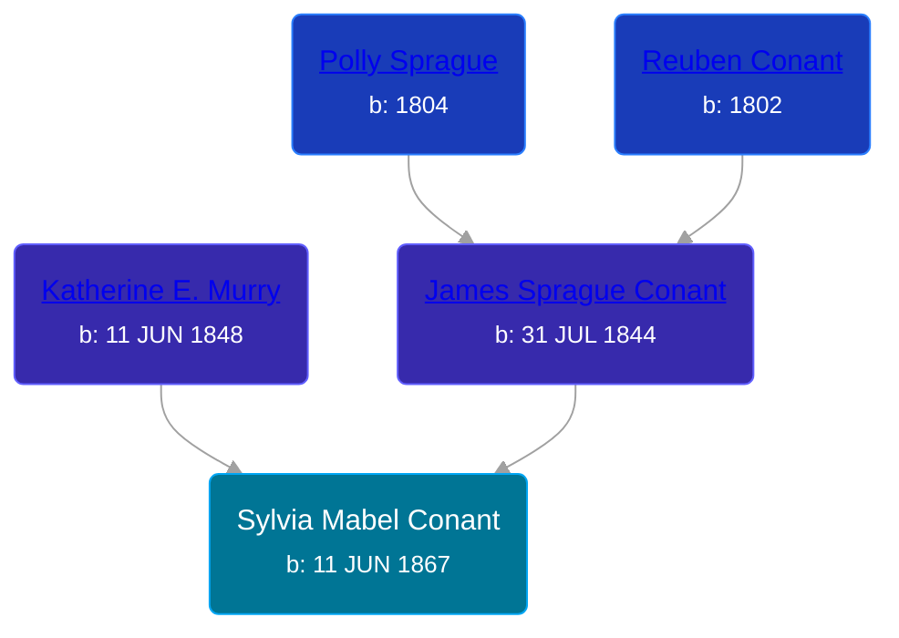

## 🟣 Sylvia Mabel Conant
<small>Age: 34y, 3m, 2d</small>

Daughter of [James Sprague Conant](/people/6/62404416) and [Katherine E. Murry](/people/2/25746290)





### 📆 Events


Type | Date | Age at Event | Place
------ | ------ | ------ | ------
Birth | 11 JUN 1867 |  | New York, USA
[Residence](#event-event-0) | 1880 | 12y, 5m, 19d | Robinson Township, Ottawa, Michigan, USA
[Residence](#event-event-1) | 1900 | 32y, 5m, 19d | Robinson Township, Ottawa, Michigan, USA
[Death](#event-event-5) | 13 SEP 1901 | 34y, 3m, 2d | Robinson Township, Ottawa, Michigan, USA



- **Birth**
**Date**: 11 JUN 1867, Age:
**Place**: New York, USA
- **[Residence](#event-event-0)**
**Date**: 1880, Age: 12y, 5m, 19d
**Place**: Robinson Township, Ottawa, Michigan, USA
- **[Residence](#event-event-1)**
**Date**: 1900, Age: 32y, 5m, 19d
**Place**: Robinson Township, Ottawa, Michigan, USA
- **[Death](#event-event-5)**
**Date**: 13 SEP 1901, Age: 34y, 3m, 2d
**Place**: Robinson Township, Ottawa, Michigan, USA


## 👩‍❤️‍👨 Relationships

### 🔵 [Sincoln French](/people/6/69338120), b. about 1862

#### Children With Sincoln French
* 🟣 [Susie French](/people/1/14699520), b. Nov 1881
* 🟣 [Emma French](/people/4/42805740), b. June 1884
* 🔵 [Carl French](/people/5/56637000), b. Aug 1889
* 🔵 [Katie French](/people/2/2635370), b. Dec 1892
### 📰 Event Sources

####  Residence, 1880
* 1880 US Census

####  Residence, 1900
* 1900 US Census

####  Death, 13 SEP 1901
* Michigan Death Certificates
