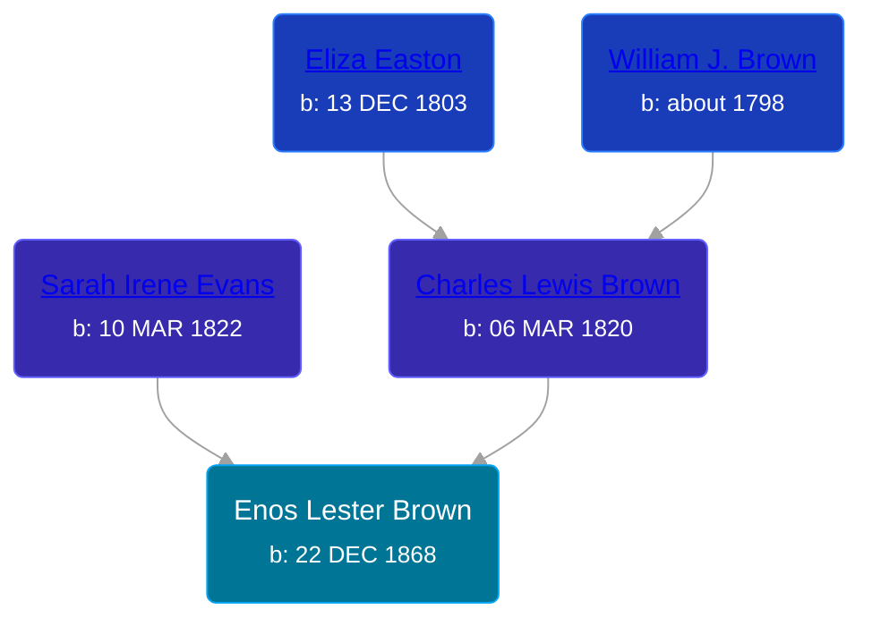

## 🔵 Enos Lester Brown

Son of [Charles Lewis Brown](/people/7/70538697) and [Sarah Irene Evans](/people/4/47294572)





### 📆 Events


Type | Date | Age at Event | Place
------ | ------ | ------ | ------
[Birth](#event-event-2) | 22 DEC 1868 |  | Union Township, Isabella, Michigan, USA



- **[Birth](#event-event-2)**
**Date**: 22 DEC 1868, Age:
**Place**: Union Township, Isabella, Michigan, USA


### 📰 Event Sources

####  Birth, 22 DEC 1868
* Isabella County Birth Records
>   
  > Child No.: 149  
  > Birth Date: 12/22/68  
  > Name: Enos Lester Brown  
  > Sex: Male  
  > Birth Place: Union  
  > Full Name of Each: Charles L. Brown & Sarah Brown  
  > Residence: Union, MI  
  > Birth Place: Not Given  
  > Occupation of Father: Farmer  
  > Date of Record: 06/05/69