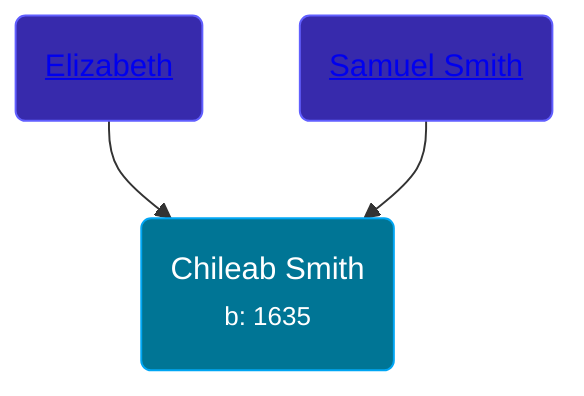

## 🔵 Chileab Smith
<small>Age: 96y, 3m, 7d</small>

Son of [Samuel Smith](/people/8/86804391) and [Elizabeth ](/people/7/71389724)





### 📆 Events


Type | Date | Age at Event | Place
------ | ------ | ------ | ------
[Birth](#event-event-2) | 1635 |  |
[Death](#event-event-3) | 07 MAR 1731 | 96y, 3m, 7d |



- **[Birth](#event-event-2)**
**Date**: 1635, Age:
**Place**:
- **[Death](#event-event-3)**
**Date**: 07 MAR 1731, Age: 96y, 3m, 7d
**Place**:


### 📰 Event Sources

####  Birth, 1635
* History of the Town of Sunderland, Massachusetts  - 532

####  Death, 07 MAR 1731
* History of the Town of Sunderland, Massachusetts  - 533