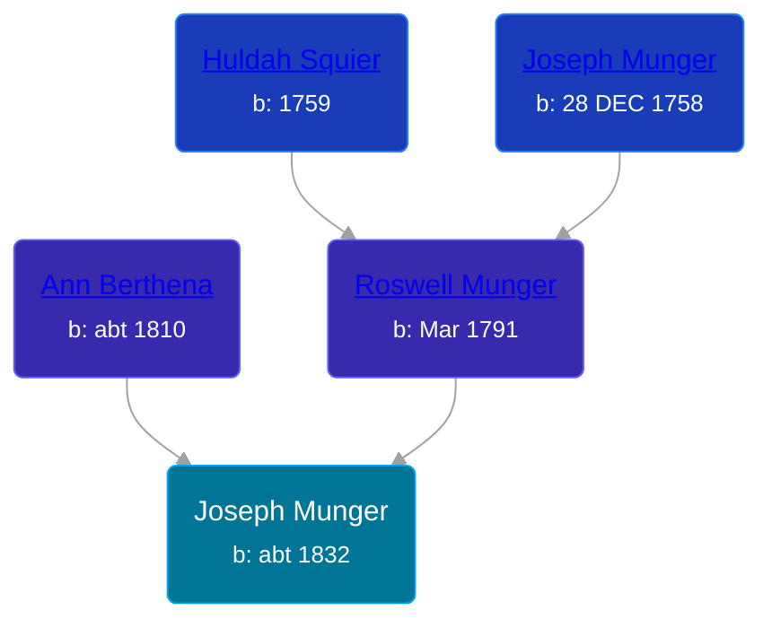

## 🔵 Joseph Munger

Son of [Roswell Munger](/people/2/21686617) and [Ann Berthena ](/people/9/91501676)





### 📆 Events


Type | Date | Age at Event | Place
------ | ------ | ------ | ------
Birth | abt 1832 |  |
[Residence](#event-event-0) | 1850 | 18y | LaGrange, Lorain, Ohio, USA
[Residence](#event-event-1) | 1860 | 28y | LaGrange, Lorain, Ohio, USA



- **Birth**
**Date**: abt 1832, Age:
**Place**:
- **[Residence](#event-event-0)**
**Date**: 1850, Age: 18y
**Place**: LaGrange, Lorain, Ohio, USA
- **[Residence](#event-event-1)**
**Date**: 1860, Age: 28y
**Place**: LaGrange, Lorain, Ohio, USA


### 📰 Event Sources

####  Residence, 1850
* 1850 US Census

####  Residence, 1860
* 1860 US Census
